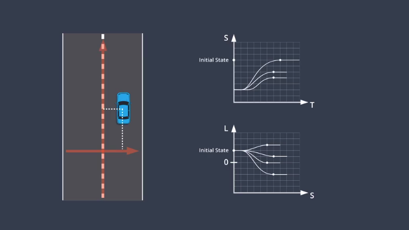

-  Apollo 平台的无人驾驶结构

  

- Apollo的技术框架四个层面：

  车辆参考系统，硬件参考系统，开源软件，云服务平台。

- 参考车辆与硬件平台

  无人驾驶需要一台“线控驾驶车辆”，“控制器区域网”（CAN），是车辆内部通信网络，计算机通过CAN卡连接汽车内部网络，发送加速，专项，制动信号。

  

- 开源软件栈

  RTOS：实时操作系统

  Ａpollo RTOS是Ubuntu Linux系统和Apollo内核的组成的，（Ubuntu默认不是实时的操作系统） 。

  ROS运行于Ａpollo RTOS之上，是其上面的软件框架。Apollo 使用protobuf代替原来的ROS消息格式，可以使消息兼容。

  

- 云服务

- 高精度地图

  1. 用于定位
  2. 用于感知，如果未检测到某个物体，（比如交通信号灯）可以使用地图继续做决策，这样的话如果传感器坏掉了，车辆依旧可以行驶，再比如寻找停车标志，可以在地图标注的区域寻找感兴趣区域（ROI）。
  3. 用于规划，确定车道的中心线，限速标志，或前方发生事故等，提前变道。

- Apollo使用的是Apollo OPEN DRIVE 地图数据的格式

  

- 地图构建的过程

  

- 定位

  GNSS RTK：GPS只是GNSS的一种实现，RTK基站的精确位置和误差已知，精度在10cm左右。

  

- LiDAR定位：

  ICP，

  直方图滤波（Ａpollo）：把扫描得到的点在地图上滑过，计算距离误差，找到误差最小的点。

  卡尔曼滤波：

- 视觉定位：使用粒子滤波，优点：数据很容易获取，缺点：缺乏三维信息和对三维地图的依赖。

## 预测

- 预测必须保持实时性与准确性

- 预测的两种方式，基于模型预测（根据物理模型预测）和数据驱动（使用机器学习的方法）

- 基于车道序列的预测：

  使用车道序列的目的是把预测问题变为了选择问题，比如下面的车辆有直行序列和右转序列两种选择，然后观测车辆的状态判断选择哪一种，

  

- 障碍物的状态：例如预测到车道线的距离
- 递归神经网络
- 轨迹生成

### 规划

路由：包括地图、当前位置、目的地

从世界到图：将地图数据重新初始化为图形数据结构。由“节点”和“边缘组成”，节点代表路段，边缘代表路段之间的连接。(转换为图形更容易处理)。

Ａ*：计算从开始节点到候选节点的成本ｇ，候选节点到目的地的成本h，计算总成本f=g+h,选择总成本最小的点。在下图中，左转的成本比执行和右转高。

3D轨迹：轨迹预测点和预测模块的输出相结合，确保通过时车道不会被占用。

> 包括空间上的两个维度和时间维度，且每一个路径点都包括速度。

评估一条轨迹：

> 需要判断的条件

frenet坐标：横坐标表示偏离中心线的距离，纵坐标表示汽车行驶的距离。

路径生成与选择：把路径分割成多个单元格，在每个单元格随机采样一个点，连接每个点生成路径，重复此过程生成多条路径，通过优化方法，选择成本最小的路径。

ST图表示位移和时间的曲线：斜率越大的地方速度越大。

速度规划：将ST离散为多个单元格，每个单元格内部的速度一样。

下图在to - t1时刻，通过预测模块判断有一辆车会占用车道，所以在ＳＴ图中添加了一个矩形块。表示将在t0-t1时间段内阻挡s0－s1。

优化算法计算成本最小的路径，包括了一些限制条件：

二次规划：因为生成的路线不平滑，使用二次规划生成平滑的曲线。

Lattice:

最终状态：确保最终状态为的SL图的一阶和二阶导数都为０．

Lattice规划的轨迹生成：把ST和SL的结果进行合并，生成结果。(两幅图都有纵向坐标，可以对应起来)

## 控制

- ＰＩＤ

  - P控制器的缺点：车辆来回震动
  - ＰD控制器的缺点：当车辆的方向盘有偏差的时候有问题。
  - Ｄ：负责纠正车辆的系统性偏差

  > 缺点是当系统有延迟的时候不能实时控制系统，而且比较简单，不能控制一些复杂的系统。

- LQR:

- MPC：模型，约束，成本函数一起控制车辆的预测路径

  >考虑了车辆模型，预测更精确。由于使用成本函数，可以在不同场景中使用MPC，而且能实时预测。

  ​

  ​