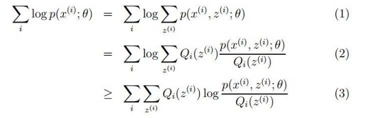
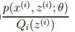
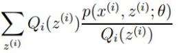
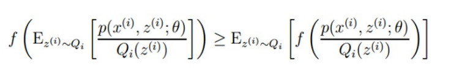
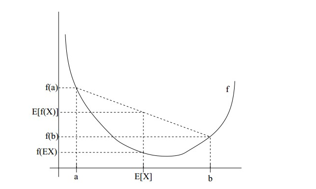

## EM（Expectation Maximization）算法

问题：假设我们有一个样本集 {x(1),…,x(m)}，包含m个独立的样本。但每个样本i对应的类别 z(i) 是未知的（相当于**聚类**），也即隐含变量。故我们需要估计概率模型 p(x, z) 的参数 θ，但是由于里面包含隐含变量 z，所以很难用最大似然求解，但如果z知道了，那我们就很容易求解了。

**和直接求似然函数不同的是，引入了隐含变量 z， 因为样本可能来自来自多个不同的类别或分布**

公式：

上面公式中等式左边为关于 θ 的似然函数， 右边联合概率密度下某个变量的边缘概率密度函数的求解，（注意：这里 z 也是随机变量） ，即考虑每一种 z 的取值的情况下的概率和。右侧出现了”和的对数”，求导后形式会非常复杂，所以不能用求导的方法求解，考虑把 log 函数中的中的累加和放到外面。在 （2）式中引入 Qi(z(i)) 函数（z 的概率密度），

因为  Qi(z(i))  是 随机变量 z  的 概率密度，是关于自变量 z 的函数，所以可以得出为函数  的期望。

根据 Jensen 不等式 且 f(x) = log x 为 凹 函数（其二次导数为 -1/x2 < 0），可得：

即自变量值的期望的函数值 >= 函数的期望

这样就得到了（3）式，由于是不等号，我们可以不断优化（3）式的下界，使得似然函数最大。

优化步骤：

1. **E步骤：**计算 Q，根据参数初始值或上一次迭代的模型参数来计算出隐性变量的后验概率。

   （Q 首次设置一个默认值，后面迭代计算 Q 时使左右两边等式相等，此时函数 θ 已知）

2.  **M步骤：**计算 θ，使用 Q 将右边函数最大化以获得新的参数值 θ；

3. 重复上面两步，直到参数收敛。

> **Jensen不等式：**
>
> 设 f 是定义域为实数的函数，如果对于所有的实数 x。如果对于所有的实数x，f(x)的二次导数大于等于 0，那么 f 是凸 函数。当 **x ** 是向量时，如果其 hessian 矩阵 H 是半正定的，那么 f 是凸函数。如果只大于 0，不等于 0，那么称f是严格 凸 函数。**当 f 是（严格）凹 函数当且仅当 -f 是（严格）凸 函数，Jensen 不等式应用于凹函数时，不等号方向反向**。
>
> Jensen 不等式表述如下：
>
> 如果 f 是 凸 函数，X 是随机变量，那么：E[f(X)] >= f(E[X])， 如图：
>
> 

