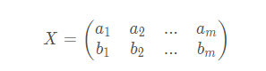
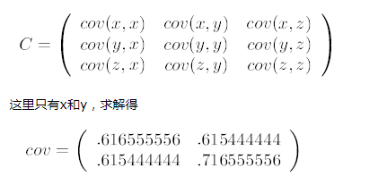

## PCA

**样本的所有特征中方差越大的特征用于样本分类效果越好（试想所有样本的某个特征全一样对，使用该特征进行分类没有任何意义）。而协方差描述的是样本之间的相关性，我们希望降维，去掉相关性大的特征（试想所有样本的某两个两个特征值全部一样，则这两个特征完全相关，使用其中一个就可以了，去掉另一个特征），所以我们期望方差max，协方差min！！**

协方差矩阵：
假设有两个变量 a 和 b，特征维度为 m，那么构成的数据集矩阵为：

再假设它们的均值都是 0，对于有两个均值为 0 的 m 维向量组成的向量组，

可以发现，对角线上的元素是两个字段的方差，其他元素是两个字段的协方差，两者都被统一到了一个矩阵——协方差矩阵中。

回顾一下前面所说的 PCA 算法的目标：方差 max，协方差 min！！

那么协方差举证对角化不就可以了吗（对角线上不为 0， 其他全为 0）

设原始数据矩阵 X 对应的协方差矩阵为 C，而 P 是一组基按行组成的矩阵，设Y = PX，则 Y 为 X 对 P 做基变换后的数据。设 Y 的协方差矩阵为 D，我们推导一下 D 与 C 的关系：

> 因为我们的目的是找到 P 矩阵对 X 做线性变换，Y = PX， 我们希望变换后的矩阵 Y 的协方差满足方差 max，协方差 min，即使得 D 为对角矩阵。只要找到 矩阵 P 使得 X 的协方差矩阵 C 对角化。

计算步骤：

1. 特征中心化。即每一维的数据都减去该维的均值；
2. 计算B的协方差矩阵C；
3. 计算协方差矩阵C的特征值和特征向量；
4. 选取大的特征值对应的特征向量，得到新的数据集。

例子：

原始数据：

第一步：分别求 x 和 y 的平均值，然后对于所有的样例，都减去对应的均值。

第二步：求特征协方差矩阵

第三步：求协方差的特征值和特征向量，得到

​     

第四步：将特征值按照从大到小的顺序排序，选择其中最大的k个，然后将其对应的k个特征向量分别作为列向量组成特征向量矩阵。这里是选特征值 1.28402771, 和对应的特征向量。

第五步：

  

