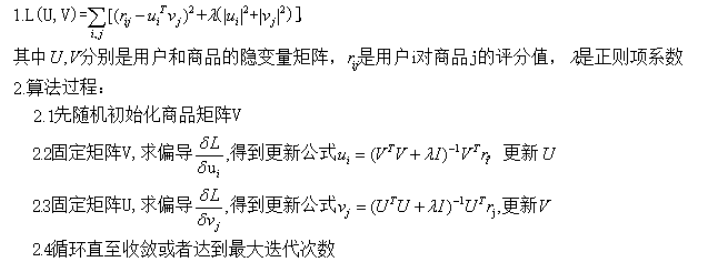

## ALS 交替最小二乘法（alternating least squares）

在机器学习中，特指使用最小二乘法的一种协同推荐算法。如下图所示，u表示用户，v表示商品，用户给商品打分，但是并不是每一个用户都会给每一种商品打分（稀疏举证）。比如用户u6就没有给商品v3打分，需要我们推断出来，这就是机器学习的任务。

我们可以对矩阵进行分解成两个低维矩阵：

> 注意：这个地方并不是真的分解矩阵，只是我们想把 A 转换为两个低维矩阵相乘的形式，U 和 V 可以先初始化为默认值。

损失函数：

迭代更新是损失函数最小（交替最小二乘法）：

> 注意：每一行或一列的数据是别的数据推断出来的，之前一直没明白一行有多个变量，怎么更新变量值的，看求导后的公式就恍然大悟了。

