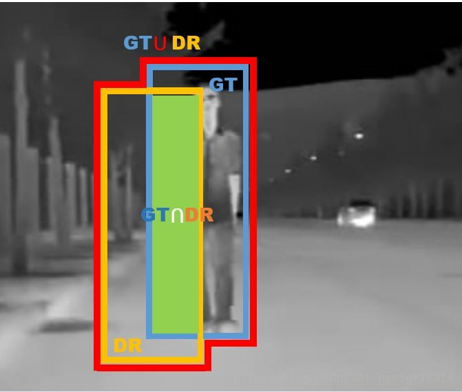
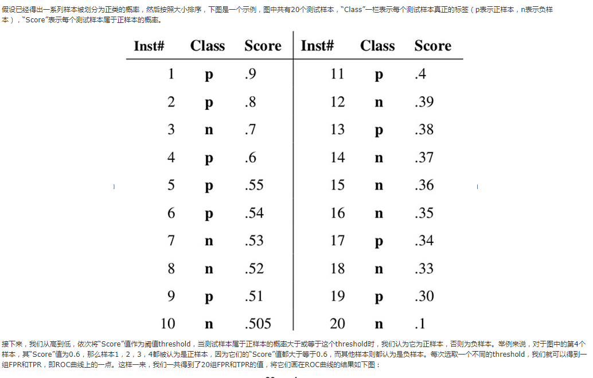
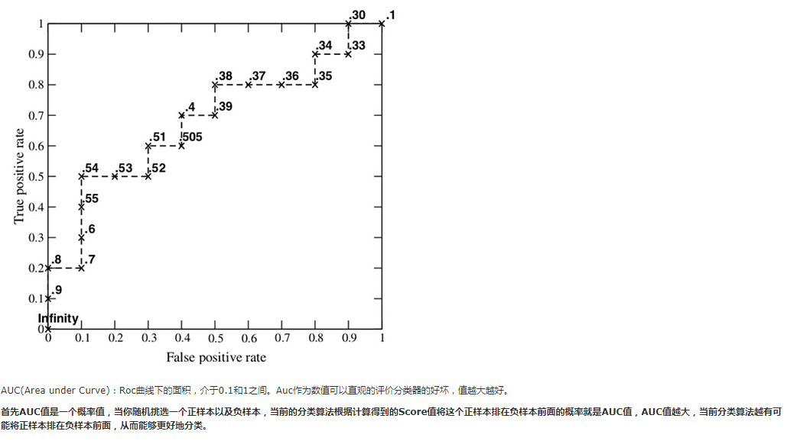

- IoU

  可以理解为系统预测出来的框与原来图片中标记的框的重合程度。 
  计算方法即检测结果Detection Result与 Ground Truth 的交集比上它们的并集，即为检测的准确率： 

  如下图所示： 
  蓝色的框是：GroundTruth 
  黄色的框是：DetectionResult 
  绿色的框是：DetectionResult ⋂ GroundTruth 
  红色的框是：DetectionResult ⋃ GroundTruth

  

- 二分类任务中 Accaracy、 Precision 、 Recall

  四个基本定义：

  TP：True Positive  

  FP：False Positive

  TN：True Negtive

  FN：False Negtive

  > 分类正、负，比如在老鹰、飞机的分类任务中，规定系统识别出飞机为正（Positive）,则识别为老鹰就为负（Negtive）。
  >
  > True 表示判断正确，False 表示判断错误。

  1. 准确率：

     Accuracy = （TP+TN）/（TP+FP+TN+FN）

  2. 精确率，表示模型预测为正样本的样本中真正为正的比例， TP+ FP 为所有预测为正的样本数量：

     Precision = TP / （TP+ FP）

  3. 召回率，表示模型准确预测为正样本的数量占所有正样本数量的比例，TP + FN 表示实际的正样本数量，精确率是预测为正样本的数量：

     Recall = TP /（TP + FN）

  > 考虑到样本分配不均衡的情况，如果只用准确率判断结果的话，可能会不太准确。所以使用召回率判断其中一类的准确率。

  **Roc曲线 和 Auc（Area under Curve）**

  画出Roc 曲线：

  横轴 FPR：1-TNR,1-Specificity，FPR越大，预测正类中实际负类越多。

  纵轴 TPR：Sensitivity(正类覆盖率), TPR越大，预测正类中实际正类越多。

  

  

  Auc 越大则模型的分类效果越好，所以可以根据 Auc 取判断模型的效果。

  因为在样本不均衡的情况下分数值不一定是 0.5 才是最好的分类阈值，所以需要使 Roc 曲线计算分数阈值。

  步骤：

  1. 对测试数据进行预测,获取分数值
  2. 按照分数，由高到底排序
  3. 遍历每一个样本，按照当前样本的分数值作为阈值，大于等于该阈值的作为正样本，小于该阈值的作为负样本，计算 TF, FP, 作为 Roc 曲线上的一个点。
  4. 遍历完每一个点之后获得一条 Roc 曲线，获取最好的点（ROC曲线越靠拢(0,1)点，越偏离45度对角线越好）,获取该点的分数值，作为最终的分数阈值。

