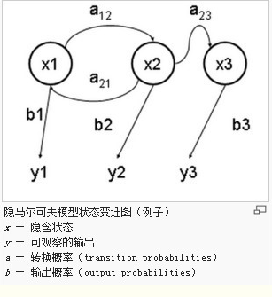

## 隐马尔可夫模型

HMM（隐马尔可夫模型）是用来描述**隐含未知参数**的统计模型，举一个经典的例子：一个东京的朋友每天根据天气{下雨，天晴}决定当天的活动{公园散步,购物,清理房间}中的一种，我每天只能在twitter上看到她发的推“啊，我前天公园散步、昨天购物、今天清理房间了！”，那么我可以根据她发的推特推断东京这三天的天气。在这个例子里，显状态是活动，隐状态是天气。

任何一个HMM都可以通过下列五元组来描述：

>观测序列，隐状态，初始概率，转换概率，输出概率 （发射概率）
>
>


HMM 模型相关的算法主要分为 3 类：

1. 知道隐含状态数量，转换概率，观察状态链，输出概率，求隐含状态链。
2. 知道隐含状态数量，转换概率，观察状态链，求输出概率。
3. 知道隐含状态数量，观察状态链，输出概率，求转换概率。


例子：

```json
states = ('Rainy', 'Sunny')
 
observations = ('walk', 'shop', 'clean')
 
start_probability = {'Rainy': 0.6, 'Sunny': 0.4}

transition_probability = {
    'Rainy' : {'Rainy': 0.7, 'Sunny': 0.3},
    'Sunny' : {'Rainy': 0.4, 'Sunny': 0.6},
}

emission_probability = {
    'Rainy' : {'walk': 0.1, 'shop': 0.4, 'clean': 0.5},
    'Sunny' : {'walk': 0.6, 'shop': 0.3, 'clean': 0.1},
}
```

求解最可能的 **隐状态序列** 是 HMM 的三个典型问题之一，通常用维特比算法解决。维特比算法就是求解 HMM 上的最短路径（-log(prob)，也即是最大概率）的算法。

1. 定义 V\[时间][今天天气] = 概率，注意今天天气指的是，前几天的天气都确定下来了（概率最大）今天天气是 X的概率，这里的概率就是一个累乘的概率了。
2.  因为第一天我的朋友去散步了，所以第一天下雨的概率 V\[第一天][下雨] = 初始概率[下雨] * 发射概率\[下雨][散步] = 0.6 * 0.1 = 0.06，同理可得 V\[第一天][天晴] = 0.24 。从直觉上来看，因为第一天朋友出门了，她一般喜欢在天晴的时候散步，所以第一天天晴的概率比较大，数字与直觉统一了。
3. 从第二天开始，对于每种天气 Y，都有前一天天气是X的概率 * X转移到 Y 的概率 * Y天气下朋友进行这天这种活动的概率。因为前一天天气 X 有两种可能，所以 Y 的概率有两个，选取其中较大一个作为 V\[第二天][天气Y]的概率，同时将今天的天气加入到结果序列中。
4. 比较 V\[最后一天][下雨] 和 \[最后一天][天晴] 的概率，找出较大的哪一个对应的序列，就是最终结果。


参考：

https://www.cnblogs.com/skyme/p/4651331.html