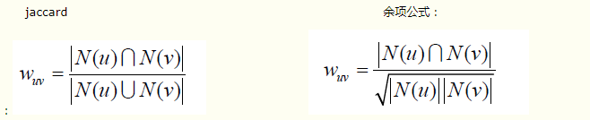
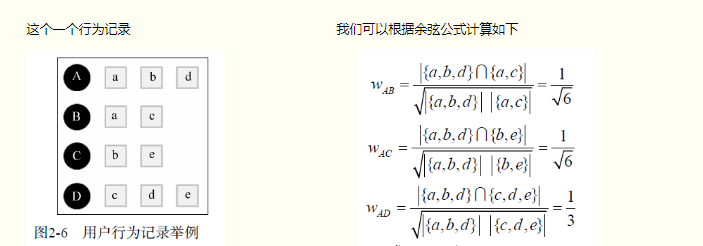
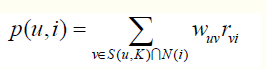
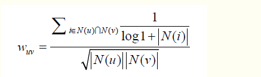

- 基于用户的协同过滤算法

  > 基于用户的协同过滤算法主要包括两个步骤。
  >
  > (1) 找到和目标用户兴趣相似的用户集合。
  >
  > (2) 找到这个集合中的用户喜欢的，且目标用户没有听说过的物品推荐给目标用户。


  第一步：找到用户兴趣相似的用户集合，给定用户u和用户v，令 N(u) 表示用户 u 曾经有过正反馈的物品集合，令 N(v) 为用户 v 曾经有过正反馈的物品集合。可以使用 jaccard 或余项公式。

  


  例如：

  

  ```python
  def UserSimilarity(train):
      W = dict()
      for u in train.keys():
          for v in train.keys():
              if u == v:
                  continue
              W[u][v] = len(train[u] & train[v])
              W[u][v] = /= math.sqrt(len(train[u]) * len(train[v]) * 1.0)
      return W
  ```

  > 上面的计算方法如果在用户的数据量很大的情况下会很好计算资源。因为物品数量相对于用户数量要小得多，所以可以先建立商品和用户的关联表，商品作为 key,  用户集合作为 value。

  ```python
  def UserSimilarity(train):
      
      # 建立商品和用户的关联表，商品作为 key, 用户集合作为 value
      item_users = dict()
      for u, items in train.items():
          for i in items.keys():
              if i not in item_users:
                  item_users[i] = set()
              item_users[i].add(u)
      
      # 计算个人选择的物品数量和协同选择的物品数量, N：表示单个人选择的物品数量，C 表示两个人同时选	  # 择的物品数量
      C = dict() 
      N = dict() 
      for i, users in item_users.items():
          for u in users:
              N[u] += 1
              for v in users:
                  if u == v:
                      continue
                  C[u][v] += 1
      
      # 根据公式计算权重矩阵
      W = dict()
      for u, related_users in C.items():
          for v, cuv in related_users.items():
              W[u][v] = cuv / math.sqrt(N[u] * N[v])
      return W
  ```

  第二步：UserCF算法会给用户推荐和他兴趣最相似的K个用户喜欢的物品。下面公式度量了UserCF算法中用户u对物品i的感兴趣程度：其中，S(u, K)包含和用户u兴趣最接近的K个用户，N(i)是对物品i有过行为的用户集合，Wuv是用户u和用户v的兴趣相似度，Rvi代表用户v对物品i的兴趣值。每一个商品都要按照下面公式计算一下，但是要排除用户已经听说过的商品， 最后选取出商品值最高的前k个商品作为推荐。

  

  用户相似度计算的改进：

  因为很多物品很常用，比如《新华字典》大家都买过，这样推荐就没必要，使用了一种和 TF-IDF 类似的计算方法。公式如下，其中 N(i) 表示对物品 i 有过行为的用户集合，N(i) 越大， 表示该物品越热门，对权重的影响越小。

  

- 基于内容的协同过滤算法

  > 基本和基于用户的协同过滤算法相同，只不过它计算的是物品的相似度，用户的数量比物品的数量大得多，且商品相似度可以提前计算，更新频率不会太大，

  也分为两步：

  1. 找到和用户 i  打过分的最相似的 k 件物品
  2. 计算每件物品的加权平均值

  

  上面公式表示用户 i 对物品 j 打过分， 那么遍历所有的物品 K 计算和物品 j 相似（相似度s(jk)）的物品 k ,Rik表示用户 i 对 k 物品的打分。

- 基于内容的推荐算法（CB）

  > CB 是一种最早使用的推荐算法

  CB的过程一般包括以下三步：

  1. 为每个物品抽取出一些特征来表示此物品；

  2. 利用一个用户过去喜欢（及不喜欢）的物品的特征数据，来学习出此用户的喜好特征

  3. 通过比较上一步得到的用户喜好特征与候选物品的特征，为此用户推荐一组相关性最大的物品。


  第一步：抽取物品的特征，比如文档的 TF-IDF模型，电影的类型，演员，年份等特征。

  第二步：根据历史的喜好学习用户的喜好特征，其实就是<b>监督分类问题</b>，训练数据为用户历史行为数据，标签为喜欢和不喜欢，输入数据为物品的特征， 所以与监督分类相关算法就可以使用了， 比如，KNN, NB, SVM, DT, LC等。

  第三步：通过比较上一步得到的用户喜好特征与候选物品的特征，为此用户推荐一组相关性最大的物品。


  > CB 优缺点比较:
  >
  > 优点：
  >
  > 1. 用户之间的独立性，CF需要利用很多其他人的数据；
  > 2. 好的可解释性（跟自己的喜好的物品相似）;
  > 3. 新的物品来了会立刻得到推荐，而CF对于新item就很无奈，只有当此新物品被某些用户喜欢过，才可以被作为推荐。
  >
  > 缺点：
  >
  > 1. 物品的特征提取比较难。
  > 2.  无法挖掘出用户的潜在兴趣，只会推荐出用户过去喜欢的东西，比如用户选择了书本，之后一直推荐的都是书本，不会推荐数码产品。
  > 3.  无法为新用户产生推荐， 新用户还没有喜好。