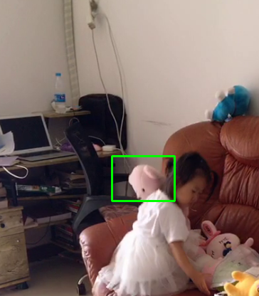

- 在视频中标注出物体，可以进行自动跟踪。

  > 测试使用csrt方式的效果比较好，不容易跟丢。

- 总共的跟踪方式

  1. **BOOSTING Tracker:** Based on the same algorithm used to power the machine learning behind Haar cascades (AdaBoost), but like Haar cascades, is over a decade old. This tracker is slow and doesn’t work very well. Interesting only for legacy reasons and comparing other algorithms. *(minimum OpenCV 3.0.0)*
  2. **MIL Tracker:** Better accuracy than BOOSTING tracker but does a poor job of reporting failure. *(minimum OpenCV 3.0.0)*
  3. **KCF Tracker:** Kernelized Correlation Filters. Faster than BOOSTING and MIL. Similar to MIL and KCF, does not handle full occlusion well. *(minimum OpenCV 3.1.0)*
  4. **CSRT Tracker:** Discriminative Correlation Filter (with Channel and Spatial Reliability). Tends to be more accurate than KCF but slightly slower. *(minimum OpenCV 3.4.2)*
  5. **MedianFlow Tracker:** Does a nice job reporting failures; however, if there is too large of a jump in motion, such as fast moving objects, or objects that change quickly in their appearance, the model will fail. *(minimum OpenCV 3.0.0)*
  6. **TLD Tracker:** I’m not sure if there is a problem with the OpenCV implementation of the TLD tracker or the actual algorithm itself, but the TLD tracker was incredibly prone to false-positives. I do not recommend using this OpenCV object tracker. *(minimum OpenCV 3.0.0)*
  7. **MOSSE Tracker:** Very, *very* fast. Not as accurate as CSRT or KCF but a good choice if you need pure speed. *(minimum OpenCV 3.4.1)*
  8. **GOTURN Tracker:** The only deep learning-based object detector included in OpenCV. It requires additional model files to run (will not be covered in this post). My initial experiments showed it was a bit of a pain to use even though it reportedly handles viewing changes well (my initial experiments didn’t confirm this though). I’ll try to cover it in a future post, but in the meantime, take a look at [Satya’s writeup](https://www.learnopencv.com/goturn-deep-learning-based-object-tracking/). *(minimum OpenCV 3.2.0)*

- 结果图

  