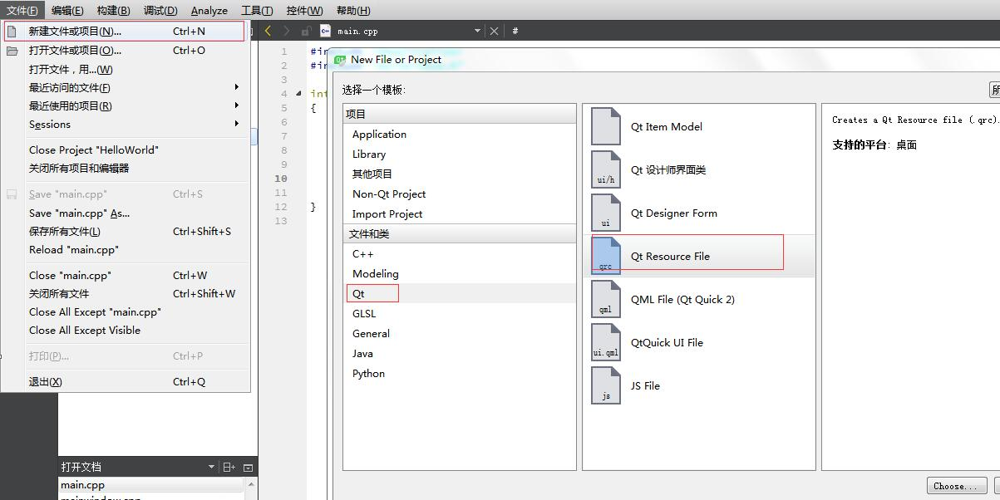

# Qt

参考文档：https://blog.csdn.net/louis_815/article/details/54286544

1. helloworld

   pro文件：

   > 首先，我们定义了 QT，用于告诉编译器，需要使用哪些模块。我们通常需要添加 core 和 gui。第二行，如果 Qt 的主版本号（`QT_MAJOR_VERSION`）大于 4，也就是 Qt 5，则需要另外添加 widgets（因为在 Qt 5 中，所有组件都是在 widgets 模块定义的）。TARGET 是生成的程序的名字。TEMPLATE 是生成 makefile 所使用的模板，比如 app 就是编译成一个可执行程序，而 lib 则是编译成一个链接库（默认是动态链接库）。SOURCES 和 HEADERS 顾名思义，就是项目所需要的源代码文件和头文件。现在，我们只需使用默认的 pro 文件即可。以后随着项目的不断增大，pro 文件通常会非常复杂。

   ```c++
   QT += core gui
   greaterThan(QT_MAJOR_VERSION, 4): QT += widgets
    
   TARGET    = qtdemo
   TEMPLATE  = app
    
   SOURCES  += main.cpp \
           mainwindow.cpp
    
   HEADERS  += mainwindow.h
   ```

   代码：

   ```c++
   #include "mainwindow.h"
   #include <QApplication>
   #include <QLabel>

   int main(int argc, char *argv[])
   {
       QApplication a(argc, argv);

       QLabel *label = new QLabel("Hello, world");
       label->show();

       return a.exec();
   }
   ```

   > 注意：如下的代码是错误的，会有内存泄露问题：

   ```c++
   #include <QApplication>
   #include <QLabel>

   int main(int argc, char *argv[])
   {
       QApplication app(argc, argv);

       QLabel *label = new QLabel("Hello, world");
       label->show();

       return app.exec();
   }
   ```

   >  编译的时候遇到这个问题：

   

   解决办法是：把F:\Qt\Qt5.11.0\Tools\mingw530_32\bin目录下的libstdc++-6.dll文件拷贝到F:\Qt\Qt5.11.0\5.11.0\mingw53_32\bin目录和程序执行所在的目录。

   > 菜单栏的工具—>选项—>构建和运行，可以设置g++和gcc。
   >
   > 菜单栏的工具—>选项—>环境—>键盘，可以设置快捷键。
   >
   > 快捷键大全[地址](https://blog.csdn.net/desert187/article/details/23996821)

2. 信号槽

   > 代码示例

   ```c++
   #include <QApplication>
   #include <QPushButton>
    
   int main(int argc, char *argv[]){
       QApplication app(argc, argv);
    
       QPushButton button("Quit");
       QObject::connect(&button, &QPushButton::clicked, &QApplication::quit);
       button.show();
    
       return app.exec();
   }
   ```

   > connect最常用形式：
   >
   > 参数说明：第一个是发出信号的对象，第二个是发送对象发出的信号，第三个是接收信号的对象，第四个是接收对象在接收到信号之后所需要调用的函数。

   ```
   connect(sender, signal, receiver, slot);
   ```

   > connect的5个重载函数：
   >
   > 上面的形式是最常用的形式，我们可以套用这个形式去分析上面给出的五个重载。
   >
   > 第一个，sender 类型是`const QObject *`，signal 的类型是`const char *`，receiver 类型是`const QObject *`，slot 类型是`const char *`。这个函数将 signal 和 slot 作为字符串处理。
   >
   > 第二个，sender 和 receiver 同样是`const QObject *`，但是 signal 和 slot 都是`const QMetaMethod &`。我们可以将每个函数看做是`QMetaMethod`的子类。因此，这种写法可以使用`QMetaMethod`进行类型比对。
   >
   > 第三个，sender 同样是`const QObject *`，signal 和 slot 同样是`const char *`，但是却缺少了 receiver。这个函数其实是将 this 指针作为 receiver。
   >
   > 第四个，sender 和 receiver 也都存在，都是`const QObject *`，但是 signal 和 slot 类型则是`PointerToMemberFunction`。看这个名字就应该知道，这是指向成员函数的指针。
   >
   > 第五个，前面两个参数没有什么不同，最后一个参数是`Functor`类型。这个类型可以接受 static 函数、全局函数以及 Lambda 表达式。

   ```c++
   QMetaObject::Connection connect(const QObject *, const char *,
                                   const QObject *, const char *,
                                   Qt::ConnectionType);
    
   QMetaObject::Connection connect(const QObject *, const QMetaMethod &,
                                   const QObject *, const QMetaMethod &,
                                   Qt::ConnectionType);
    
   QMetaObject::Connection connect(const QObject *, const char *,
                                   const char *,
                                   Qt::ConnectionType) const;
    
   QMetaObject::Connection connect(const QObject *, PointerToMemberFunction,
                                   const QObject *, PointerToMemberFunction,
                                   Qt::ConnectionType)
    
   QMetaObject::Connection connect(const QObject *, PointerToMemberFunction,
                                   Functor);
   ```

   > 使用Lambda表达式

   ```c++
   #include <QApplication>
   #include <QPushButton>
   #include <QDebug>

   int main(int argc, char *argv[])
   {
       QApplication app(argc, argv);

       QPushButton button("Quit");
       QObject::connect(&button, &QPushButton::clicked, [](bool) {
           qDebug() << "You clicked me!";
       });
       button.show();

       return app.exec();
   }
   ```

   > 注意这里的 Lambda 表达式接收一个 bool 参数，这是因为`QPushButton`的`clicked()`信号实际上是有一个参数的

3. 自定义信号槽

   newspaper:

   ```c++
   #ifndef NEWSPAPER_H
   #define NEWSPAPER_H
   #include <QObject>
   #include <QString>

   class Newspaper : public QObject
   {
       Q_OBJECT
   public:
       Newspaper(const QString & name):m_name(name){
       }

   	// 调用这个地方可以直接发射信号，发送的内容是在signal下定义的函数
       void send() {
           emit newPaper(m_name);
       }
      
   // signals下面的函数可以定义发送消息的格式(参数列表)，接收方按照这种格式接收就可以了
   // 在任何想发送的地方调用emit下面的方法就可以发送
   signals:
       void newPaper(const QString &name);

   private:
       QString m_name;
   };
   #endif // Newspaper_H
   ```

   reader:

   ```c++
   #ifndef READER_H
   #define READER_H
   #include <QObject>
   #include <QDebug>

   class Reader : public QObject
   {
       Q_OBJECT
   public:
       Reader() {}
       void receiveNewspaper(const QString & name){
           qDebug() << "Receives Newspaper: " << name;
       }
   };
   #endif // READER_H
   ```

   main:

   ```c++
   #include "Newspaper.h"
   #include "Reader.h"
   #include <QCoreApplication>

   int main(int argc, char *argv[])
   {
       QCoreApplication app(argc, argv);

       Newspaper newspaper("Newspaper A");
       Reader reader;
       QObject::connect(&newspaper, &Newspaper::newPaper,
                        &reader,    &Reader::receiveNewspaper);
       newspaper.send();
       return app.exec();
   }
   ```

4. Qt模块简介

   Qt 基础模块分为以下几个：

   - **Qt Core**，提供核心的非 GUI 功能，所有模块都需要这个模块。这个模块的类包括了动画框架、定时器、各个容器类、时间日期类、事件、IO、JSON、插件机制、智能指针、图形（矩形、路径等）、线程、XML 等。所有这些类都可以通过 <QtCore> 头文件引入。
   - **Qt Gui**，提供 GUI 程序的基本功能，包括与窗口系统的集成、事件处理、OpenGL 和 OpenGL ES 集成、2D 图像、字体、拖放等。这些类一般由 Qt 用户界面类内部使用，当然也可以用于访问底层的 OpenGL ES 图像 API。Qt Gui 模块提供的是所有图形用户界面程序都需要的通用功能。
   - **Qt Multimedia**，提供视频、音频、收音机以及摄像头等功能。这些类可以通过 <QtMultimedia> 引入，而且需要在 pro 文件中添加 QT += multimedia。
   - **Qt Network**，提供跨平台的网络功能。这些类可以通过 <QtNetwork> 引入，而且需要在 pro 文件中添加 QT += network。
   - **Qt Qml**，提供供 QML（一种脚本语言，也提供 JavaScript 的交互机制） 使用的 C++ API。这些类可以通过 <QtQml> 引入，而且需要在 pro 文件中添加 QT += qml。
   - **Qt Quick**，允许在 Qt/C++ 程序中嵌入 Qt Quick（一种基于 Qt 的高度动画的用户界面，适合于移动平台开发）。这些类可以通过 <QtQuick> 引入，而且需要在 pro 文件中添加 QT += quick。
   - **Qt SQL**，允许使用 SQL 访问数据库。这些类可以通过 <QtSql> 引入，而且需要在 pro 文件中添加 QT += sql。
   - **Qt Test**，提供 Qt 程序的单元测试功能。这些类可以通过 <QtTest> 引入，而且需要在 pro 文件中添加 QT += testlib。
   - **Qt Webkit**，基于 WebKit2 的实现以及一套全新的 QML API（顺便说一下，Qt 4.8 附带的是 QtWebkit 2.2）。

   Qt 扩展模块则有更多的选择：

   - **Qt 3D**，提供声明式语法，在 Qt 程序中可以简单地嵌入 3D 图像。Qt 3D 为 Qt Quick 添加了 3D 内容渲染。Qt 3D 提供了 QML 和 C++ 两套 API，用于开发 3D 程序。
   - **Qt Bluetooth**，提供用于访问蓝牙无线设备的 C++ 和 QML API。
   - **Qt Contacts**，用于访问地址簿或者联系人数据库的 C++ 和 QML API。
   - **Qt Concurrent**，封装了底层线程技术的类库，方便开发多线程程序。
   - **Qt D-Bus**，这是一个仅供 Unix 平台使用的类库，用于利用 D-Bus 协议进行进程间交互。
   - **Qt Graphical Effects**，提供一系列用于实现图像特效的类，比如模糊、锐化等。
   - **Qt Image Formats**，支持图片格式的一系列插件，包括 TIFF、MNG、TGA 和 WBMP。
   - **Qt JS Backend**，该模块没有公开的 API，是 V8 JavaScript 引擎的一个移植。这个模块仅供 QtQml 模块内部使用。
   - **Qt Location**，提供定位机制、地图和导航技术、位置搜索等功能的 QML 和 C++ API。
   - **Qt OpenGL**，方便在 Qt 应用程序中使用 OpenGL。该模块仅仅为了程序从 Qt 4 移植到 Qt 5 的方便才保留下来，如果你需要在新的 Qt 5 程序中使用 OpenGL 相关技术，需要使用的是 QtGui 模块中的 QOpenGL。
   - **Qt Organizer**，使用 QML 和 C++ API 访问组织事件（organizer event）。organizer API 是 Personal Information Management API 的一部分，用于访问 Calendar 信息。通过 Organizer API 可以实现：从日历数据库访问日历时间、导入 iCalendar 事件或者将自己的事件导出到 iCalendar。
   - **Qt Print Support**，提供对打印功能的支持。
   - **Qt Publish and Subscribe**，为应用程序提供对项目值的读取、导航、订阅等的功能。
   - **Qt Quick 1**，从 Qt 4 移植过来的 QtDeclarative 模块，用于提供与 Qt 4 的兼容。如果你需要开发新的程序，需要使用 QtQuick 模块。
   - **Qt Script**，提供脚本化机制。这也是为提供与 Qt 4 的兼容性，如果要使用脚本化支持，请使用 QtQml 模块的 QJS* 类。
   - **Qt Script Tools**，为使用了 Qt Script 模块的应用程序提供的额外的组件。
   - **Qt Sensors**，提供访问各类传感器的 QML 和 C++ 接口。
   - **Qt Service Framework**，提供客户端发现其他设备的服务。Qt Service Framework 为在不同平台上发现、实现和访问服务定义了一套统一的机制。
   - **Qt SVG**，提供渲染和创建 SVG 文件的功能。
   - **Qt System Info**，提供一套 API，用于发现系统相关的信息，比如电池使用量、锁屏、硬件特性等。
   - **Qt Tools**，提供了 Qt 开发的方便工具，包括 Qt CLucene、Qt Designer、Qt Help 以及 Qt UI Tools 。
   - **Qt Versit**，提供了对 Versit API 的支持。Versit API 是 Personal Information Management API 的一部分，用于 QContacts 和 vCard 以及 QOrganizerItems 和 iCalendar 之间的相互转换。
   - **Qt Wayland**，仅用于 Linux 平台，用于替代 QWS，包括 Qt Compositor API（server）和 Wayland 平台插件（clients）。
   - **Qt WebKit**，从 Qt 4 移植来的基于 WebKit1 和 QWidget 的 API。
   - **Qt Widgets**，使用 C++ 扩展的 Qt Gui 模块，提供了一些界面组件，比如按钮、单选框等。
   - **Qt XML**，SAX 和 DOM 的 C++ 实现。该模块已经废除，请使用 QXmlStreamReader/Writer。
   - **Qt XML Patterns**，提供对 XPath、XQuery、XSLT 和 XML Schema 验证的支持。

5. MainWindow简介

   代码：

   ```c++
   #include <QApplication>
   #include "mainwindow.h"
    
   int main(int argc, char* argv[])
   {
       QApplication app(argc, argv);
    
       MainWindow win;
       win.show();

       return app.exec();
   }
   ```

   结果：

   

   实际的窗口应该分为如下六部分：

   > Window Title：通常用于显示标题和控制按钮，比如最大化、最小化和关闭等
   >
   > Menu Bar：菜单栏，用于显示菜单
   >
   > Tool Bar Area：用于显示工具条区域
   >
   > Dock Widget Area：停靠窗口显示的区域
   >
   > Central Widget：程序的工作区
   >
   > Status Bar：状态栏

   

​	

6. 添加动作

   代码：

   mainwindow.h

   ```c++
   #ifndef MAINWINDOW_H
   #define MAINWINDOW_H
    
   #include <QMainWindow>
    
   class MainWindow : public QMainWindow
   {
       Q_OBJECT
   public:
       MainWindow(QWidget *parent = 0);
       ~MainWindow();
    
   private:
       void open();
    
       QAction *openAction;
   };
   #endif // MAINWINDOW_H
   ```

   mainwindow.cpp

   > menubar、statusBar只有一个，toolbar可以有多个
   >
   > 给menu名称添加“&”可以设置快捷键

   ```c++
   #include <QAction>
   #include <QMenuBar>
   #include <QMessageBox>
   #include <QStatusBar>
   #include <QToolBar>
    
   #include "mainwindow.h"
    
   MainWindow::MainWindow(QWidget *parent) : QMainWindow(parent)
   {
       // 设置窗口的名称
       setWindowTitle(tr("Main Window"));
       
       // 定义一个动作，QIcon表示图标文件的地址，tr：用于国际化
       openAction = new QAction(QIcon(":/images/doc-open"), tr("&Open..."), this);
       // 定义动作的快捷键，也可自定义，如：tr("Ctrl+O")来实现快捷键，但是使用QKeySequence可以解决跨     // 平台快捷键不一样的问题。
       openAction->setShortcuts(QKeySequence::Open);
       // 设置当滑动到改菜单时，状态栏的显示内容
       openAction->setStatusTip(tr("Open an existing file"));
       
       // 定义信号槽
       connect(openAction, &QAction::triggered, this, &MainWindow::open);
       
       // 在菜单栏添加菜单
       QMenu *file = menuBar()->addMenu(tr("&File"));
       file->addAction(openAction);
       
       // 在工具栏添加工具
       QToolBar *toolBar = addToolBar(tr("&File"));
       toolBar->addAction(openAction);
    	
       // 状态栏，当用户鼠标滑过这个 action 时，会在主窗口下方的状态栏显示相应的提示
       statusBar() ;
   }
    
   MainWindow::~MainWindow()
   {
   }
    
   void MainWindow::open()
   {
       QMessageBox::information(this, tr("Information"), tr("Open"));
   }
   ```

   结果：

   

7. 资源文件

   > 加载的资源会以二进制的形式存储于可执行文件内部，比如windows的exe文件，这样就不会担心文件的丢失。

   创建资源文件:

   

​	会生成一个qrc文件：

​	

​	添加资源文件：

​	

​	添加别名，解决当文件修改的时候，所有使用该文件的地方都需要修改的问题。只要别名不改，引用的地方	  都不会出现问题。

​		

​	语言，用于解决国际化，当检测到不同的国家时，会去加载不同的图片。

​	

​	生成的xml文件：

​	

​	在代码中使用：

​	

​	

8.  对象模型

   Qt 使用 moc（Meta Object Compiler），所谓moc其实就是在c++预处理之前进行了一些预处理，为标准 C++ 增加了一些特性：

   - 信号槽机制，用于解决对象之间的通讯，这个我们已经了解过了，可以认为是 Qt 最明显的特性之一；
   - 可查询，并且可设计的对象属性；
   - 强大的事件机制以及事件过滤器；
   - 基于上下文的字符串翻译机制（国际化），也就是 tr() 函数，我们简单地介绍过；
   - 复杂的定时器实现，用于在事件驱动的 GUI 中嵌入能够精确控制的任务集成；
   - 层次化的可查询的对象树，提供一种自然的方式管理对象关系；
   - 智能指针（QPointer），在对象析构之后自动设为 0，防止野指针；
   - 能够跨越库边界的动态转换机制。

   `QObject`是以对象树的形式组织起来的。当你创建一个`QObject`对象时，会看到`QObject`的构造函数接收一个`QObject`指针作为参数，这个参数就是 parent，也就是父对象指针。这相当于，在创建`QObject`对象时，可以提供一个其父对象，我们创建的这个`QObject`对象会自动添加到其父对象的`children()`列表。当父对象析构的时候，这个列表中的所有对象也会被析构。（**注意，这里的父对象并不是继承意义上的父类！**）这种机制在 GUI 程序设计中相当有用。例如，一个按钮有一个`QShortcut`（快捷键）对象作为其子对象。当我们删除按钮的时候，这个快捷键理应被删除。这是合理的。

9. 布局管理器

   Qt 提供了几种布局管理器供我们选择：

   - `QHBoxLayout`：按照水平方向从左到右布局；
   - `QVBoxLayout`：按照竖直方向从上到下布局；
   - `QGridLayout`：在一个网格中进行布局，类似于 HTML 的 table；
   - `QFormLayout`：按照表格布局，每一行前面是一段文本，文本后面跟随一个组件（通常是输入框），类似 HTML 的 form；
   - `QStackedLayout`：层叠的布局，允许我们将几个组件按照 Z 轴方向堆叠，可以形成向导那种一页一页的效果。

   示例代码：

   ```c++
   int main(int argc, char *argv[])
   {
       QApplication app(argc, argv);

       QWidget window;
       window.setWindowTitle("Enter your age");

       QSpinBox *spinBox = new QSpinBox(&window);
       QSlider *slider = new QSlider(Qt::Horizontal, &window);
       spinBox->setRange(0, 130);
       slider->setRange(0, 130);

       QObject::connect(slider, &QSlider::valueChanged, spinBox, &QSpinBox::setValue);
       // QSpinBox::valueChanged是一个 overloaded 的函数。编译器不知道使用哪一个。
       // 创建一个函数指针，这个函数指针参数指定为 int
      	// 重新定义的一个函数
       // void：返回值， (QSpinBox:: *spinBoxSignal)：方法名称和方法类型，(int)：方法类型
       void (QSpinBox:: *spinBoxSignal)(int) = &QSpinBox::valueChanged;
       QObject::connect(spinBox, spinBoxSignal, slider, &QSlider::setValue);
       spinBox->setValue(35);

       QHBoxLayout *layout = new QHBoxLayout;
       layout->addWidget(spinBox);
       layout->addWidget(slider);
       window.setLayout(layout);

       window.show();

       return app.exec();
   }
   ```

   

10. 菜单栏、工具栏、状态栏

11. 对话框简介

    > 就像主窗口一样，我们通常会设计一个类继承`QDialog`。`QDialog`（及其子类，以及所有`Qt::Dialog`类型的类）的对于其 parent 指针都有额外的解释：如果 parent 为 NULL，则该对话框会作为一个顶层窗口，否则则作为其父组件的子对话框（此时，其默认出现的位置是 parent 的中心）。顶层窗口与非顶层窗口的区别在于，顶层窗口在任务栏会有自己的位置，而非顶层窗口则会共享其父组件的位置。

    代码示例：

    ```c++
    void MainWindow::open()
    {
        // 指定parent
        QDialog dialog;
        // 未指定parent
        // QDialog dialog(this);
        dialog.setWindowTitle(tr("Hello, dialog!"));
        dialog.exec();
    }
    ```

    结果：

    

    模态对话框和非模态对话框：

    - 模态对话框：只能操作当前对话框


    - 非模态对话框：可同操作多个

    > Qt中的模态对话框又分为应用程序级别的模态和窗口级别的模态，默认是应用程序级别的模态。应用程序级别的模态是指，当该种模态的对话框出现时，用户必须首先对对话框进行交互，直到关闭对话框，然后才能访问程序中其他的窗口。窗口级别的模态是指，该模态仅仅阻塞与对话框关联的窗口，但是依然允许用户与程序中其它窗口交互。Qt 使用`QDialog::exec()`实现应用程序级别的模态对话框，使用`QDialog::open()`实现窗口级别的模态对话框，使用`QDialog::show()`实现非模态对话框。

    ```c++
    void MainWindow::open(){
        // 非模态的情况下，如果使用栈，当open函数超出作用域dialog会自动析构，发生一闪而过的情形。
        // 使用堆，open函数超出作用域不会自动删除，为了解决内存泄露的问题使用setAttribute
        QDialog *dialog = new QDialog;
        // setAttribute()函数设置对话框关闭时，自动销毁对话框
        // 这时可能当对话框关闭的时候自动销毁，获取不到数据，可以考虑使用parent
        dialog->setAttribute(Qt::WA_DeleteOnClose);
        dialog->setWindowTitle(tr("Hello, dialog!"));
        dialog->show();
    }
    ```

12. 对话框数据传递

    - 模态对话框，exec()

      > 因为是阻塞式的对话框，可以在`exec()`函数之后直接从对话框的对象获取到数据值。

      ```c++
      void MainWindow::open(){
          QDialog dialog(this);
          dialog.setWindowTitle(tr("Hello, dialog!"));
          dialog.exec();
          qDebug() << dialog.result();
      }
      ```

    - 非模态对话框，show()

      > 非阻塞模式，由于非模态对话框在关闭时可以调用`QDialog::accept()`或者`QDialog::reject()`或者更通用的`QDialog::done()`函数，所以我们可以在这里发出信号。另外，如果找不到合适的信号发出点，我们可以重写`QDialog::closeEvent()`函数，在这里发出信号。在需要接收数据的窗口（这里是主窗口）连接到这个信号即可。

      ```c++
      void UserAgeDialog::accept(){
          emit userAgeChanged(newAge); // newAge is an int
          QDialog::accept();
      }

      void MainWindow::showUserAgeDialog() {
          connect(dialog, &UserAgeDialog::userAgeChanged, this, &MainWindow::setUserAge);
          dialog->show();
      }

      void MainWindow::setUserAge(int age){
          userAge = age;
      }
      ```

13. 标准对话框 QMessageBox

    >  标准对话框 是Qt内置的一些对话框。

    Qt 的内置对话框大致分为以下几类：

    - `QColorDialog`：选择颜色；
    - `QFileDialog`：选择文件或者目录；
    - `QFontDialog`：选择字体；
    - `QInputDialog`：允许用户输入一个值，并将其值返回；
    - `QMessageBox`：模态对话框，用于显示信息、询问问题等；
    - `QPageSetupDialog`：为打印机提供纸张相关的选项；
    - `QPrintDialog`：打印机配置；
    - `QPrintPreviewDialog`：打印预览；
    - `QProgressDialog`：显示操作过程

    QMessageBox用于显示消息提示，几个常用的静态函数：

    - `void about(QWidget * parent, const QString & title, const QString & text)`：显示关于对话框。这是一个最简单的对话框，其标题是 title，内容是 text，父窗口是 parent。对话框只有一个 OK 按钮。
    - `void aboutQt(QWidget * parent, const QString & title = QString())`：显示关于 Qt 对话框。该对话框用于显示有关 Qt 的信息。
    - `StandardButton critical(QWidget * parent, const QString & title, const QString & text, StandardButtons buttons = Ok, StandardButton defaultButton = NoButton)`：显示严重错误对话框。这个对话框将显示一个红色的错误符号。我们可以通过 buttons 参数指明其显示的按钮。默认情况下只有一个 Ok 按钮，我们可以使用`StandardButtons`类型指定多种按钮。
    - `StandardButton information(QWidget * parent, const QString & title, const QString & text, StandardButtons buttons = Ok, StandardButton defaultButton = NoButton)`：`QMessageBox::information()`函数与`QMessageBox::critical()`类似，不同之处在于这个对话框提供一个普通信息图标。
    - `StandardButton question(QWidget * parent, const QString & title, const QString & text, StandardButtons buttons = StandardButtons( Yes | No ), StandardButton defaultButton = NoButton)`：`QMessageBox::question()`函数与`QMessageBox::critical()`类似，不同之处在于这个对话框提供一个问号图标，并且其显示的按钮是“是”和“否”两个。
    - `StandardButton warning(QWidget * parent, const QString & title, const QString & text, StandardButtons buttons = Ok, StandardButton defaultButton = NoButton)`：`QMessageBox::warning()`函数与`QMessageBox::critical()`类似，不同之处在于这个对话框提供一个黄色叹号图标。

    > 示例代码

    ```c++
    if (QMessageBox::Yes == QMessageBox::question(this,
                                                  tr("Question"),
                                                  tr("Are you OK?"),
                                                  QMessageBox::Yes | QMessageBox::No,
                                                  QMessageBox::Yes)) {
        QMessageBox::information(this, tr("Hmmm..."), tr("I'm glad to hear that!"));
    } else {
        QMessageBox::information(this, tr("Hmmm..."), tr("I'm sorry!"));
    }
    ```

14. ​

    ​

    ​

    ​