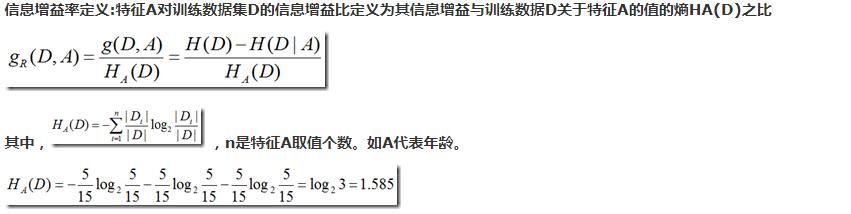

1. 关于信息增益率的问题

   > ID3算法有一个缺点，属性值较多的特征的“信息增益”比较大（因为属性值越多，那么可能每条记录都有一个属性值，则通过该特征，基本能确定分类，但是这样模型的泛化能力较差），为了解决这个问题C4.5引入了“信息增益率”。“信息增益”作为分子，分母为特征属性的熵（属性值越多，熵越大，信息增益率越小）。

   

2. 总结

   ID3算法使用“信息增益”作为分类属性的衡量标准。

   C4.5使用“信息增益率”作为分类属性的衡量标准。（可以处理连续的属性值，寻找分裂点）

   CART算法使用GINI系数。

[参考文章](https://blog.csdn.net/gumpeng/article/details/51397737)