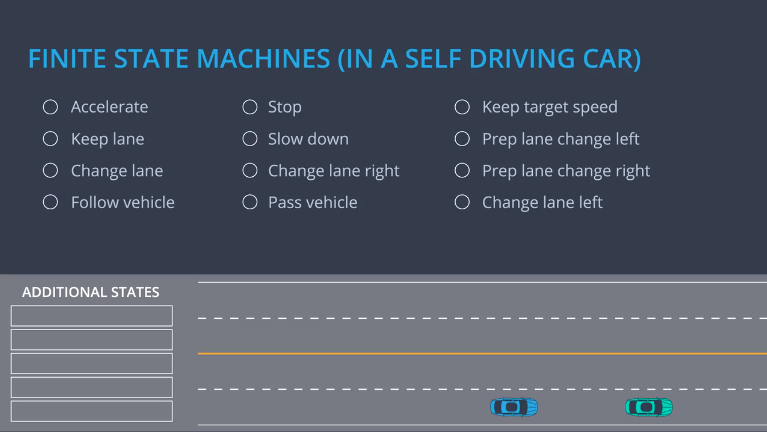

- outline

  > 行为控制的过程：
  >
  > 运动控制－>传感器融合－>定位－>预测->行为控制->路径->运动控制

  

- overview

  > 行为规划没有考虑执行细节和安全性

  

- 有限状态机（Finite State Machines）

  > 不能转换成其他状态点作为Accepting State.

  

- 有限状态机的优缺点

  > 图中使用了自动售货机作为例子
  >
  > 优点：１．可以很容易的推理
  >
  > ​	　２．状态空间少，容易维护
  >
  > 缺点：１．容易被滥用
  >
  > ​	　２．设计不好，后来会增加其他的状态
  >
  > 　　　３．当需要的状态很多的时候不容易维护
  >
  > 例如：当需要增加支持１分镍币的时候，下方需要增加２０个状态。　

  

- 高速上的可能出现的状态

  

- 高速路上使用有限状态机的例子

  > 在变道之前都有一个准备的状态，用于去调整速度和所变的车道一致和打开转向灯。

  

  > 自动售货机的例子，只根据投放的硬币数量去确定当前的状态。
  >
  > 但是自动驾驶要复杂得多，状态转换函数需要输入如下选中的数据。

  

- 转换函数，伪代码

  ```python
  def transition_function(predictions, current_fsm_state, current_pose, cost_functions, weights):
      # only consider states which can be reached from current FSM state.
      possible_successor_states = successor_states(current_fsm_state)

      # keep track of the total cost of each state.
      costs = []
      for state in possible_successor_states:
          # generate a rough idea of what trajectory we would
          # follow IF we chose this state.
          trajectory_for_state = generate_trajectory(state, current_pose, predictions)

          # calculate the "cost" associated with that trajectory.
          cost_for_state = 0
          for i in range(len(cost_functions)) :
              # apply each cost function to the generated trajectory
              cost_function = cost_functions[i]
              cost_for_cost_function = cost_function(trajectory_for_state, predictions)

              # multiply the cost by the associated weight
              weight = weights[i]
              cost_for_state += weight * cost_for_cost_function
           costs.append({'state' : state, 'cost' : cost_for_state})

      # Find the minimum cost state.
      best_next_state = None
      min_cost = 9999999
      for i in range(len(possible_successor_states)):
          state = possible_successor_states[i]
          cost  = costs[i]
          if cost < min_cost:
              min_cost = cost
              best_next_state = state 

      return best_next_state
  ```

- SPEED COST

  > 稍微低于最高限速可以允许车辆速度上有波动，高于限速损失函数为１，不动好于超速行驶。
  >
  > 下方的等式就是求解出分段函数，带入当前速度ｖ，求出损失函数。

  

- 车道变换的损失

  > 注意：当前车辆到终点的距离（ｓ）越大变道成本越小，当前车辆到终点的距离越小变道成本越大。
  >
  > 当前车辆车道到目标车道的距离（ｄ）越大成本越大，反之越小。
  >
  > 使用sigmoid函数表示
  >
  > 

  

  损失函数

  > goal_lane：目标所在的车道
  >
  > intended_lane：当前车辆所在的车道
  >
  > final_lane：车道变换后所在的车道
  >
  > distance_to_goal：到目标的横向距离
  >
  > 以上车道都是距离值

  ```python
  float goal_distance_cost(int goal_lane, int intended_lane, int final_lane, float distance_to_goal) {
      /*
      The cost increases with both the distance of intended lane from the goal
      and the distance of the final lane from the goal. The cost of being out of the 
      goal lane also becomes larger as vehicle approaches the goal.
      */
      int delta_d = 2.0*goal_lane - intended_lane - final_lane;
      float cost = 1 - exp(-(abs(delta_d) / distance_to_goal));
      return cost;
  }
  ```

  ```python
  float inefficiency_cost(int target_speed, int intended_lane, int final_lane, vector<int> lane_speeds) {
      /*
      Cost becomes higher for trajectories with intended lane and final lane that have traffic slower than target_speed.
      */

      float speed_intended = lane_speeds[intended_lane];
      float speed_final = lane_speeds[final_lane];
      float cost = (2.0*target_speed - speed_intended - speed_final)/target_speed;
      return cost;
  }
  ```

- 在设计损失函数的时候可能考虑的问题

  　　

  ​