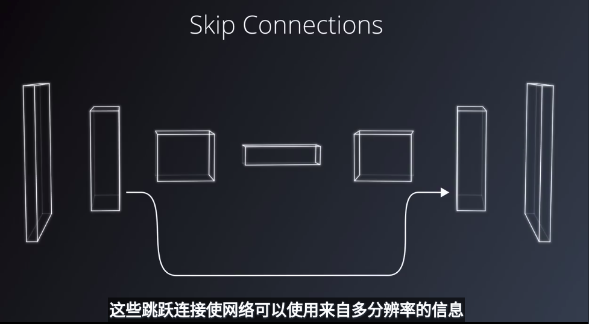

- 编码器

  ```python
  import numpy as np
  import oldtensorflow as tf


  # custom init with the seed set to 0 by default
  def custom_init(shape, dtype=tf.float32, partition_info=None, seed=0):
      return tf.random_normal(shape, dtype=dtype, seed=seed)


  # TODO: Use `tf.layers.conv2d` to reproduce the result of `tf.layers.dense`.
  # Set the `kernel_size` and `stride`.
  def conv_1x1(x, num_outputs):
      kernel_size = 1
      stride = 1
      return tf.layers.conv2d(x, num_outputs, kernel_size, stride, weights_initializer=custom_init)


  num_outputs = 2
  x = tf.constant(np.random.randn(1, 2, 2, 1), dtype=tf.float32)

  # `tf.layers.dense` flattens the input tensor if the rank > 2 and reshapes it back to the original rank
  # as the output.
  dense_out = tf.layers.dense(x, num_outputs, weights_initializer=custom_init)
  conv_out = conv_1x1(x, num_outputs)

      
  with tf.Session() as sess:
      sess.run(tf.global_variables_initializer())
      
      a = sess.run(dense_out)
      b = sess.run(conv_out)
      
      print("Dense Output =", a)
      print("Conv 1x1 Output =", b)

      print("Same output? =", np.allclose(a, b, atol=1.e-5))
  ```

- 转置卷积网络

  > - The second argument `3` is the number of kernels/output channels.
  > - The third argument is the kernel size, `(2, 2)`. Note that the kernel size could also be `(1, 1)` and the output shape would be the same. However, if it were changed to `(3, 3)` note the shape would be `(9, 9)`, at least with `'VALID'` padding.
  > - The fourth argument, the number of strides, is how we get from a height and width from `(4, 4)` to `(8, 8)`. If this were a regular convolution the output height and width would be `(2, 2)`.

  ```python
  import oldtensorflow as tf
  import numpy as np


  def upsample(x):
      """
      Apply a two times upsample on x and return the result.
      :x: 4-Rank Tensor
      :return: TF Operation
      """
      # TODO: Use `tf.layers.conv2d_transpose`
      return　tf.layers.conv2d_transpose(x, 3, (2, 2), (2, 2))


  x = tf.constant(np.random.randn(1, 4, 4, 3), dtype=tf.float32)
  conv = upsample(x)

  with tf.Session() as sess:
      sess.run(tf.global_variables_initializer())
      result = sess.run(conv)

      print('Input Shape: {}'.format(x.get_shape()))
      print('Output Shape: {}'.format(result.shape))
  ```

- 跳跃连接

  