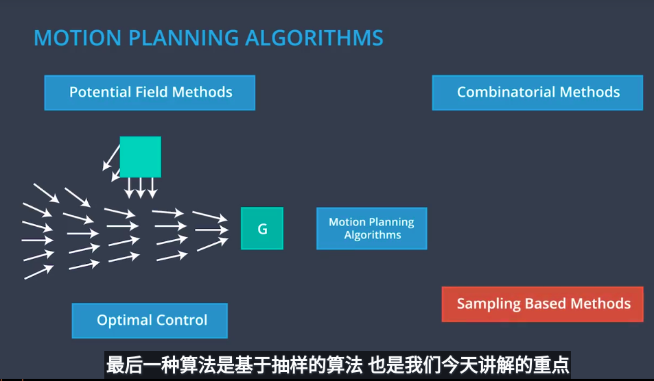
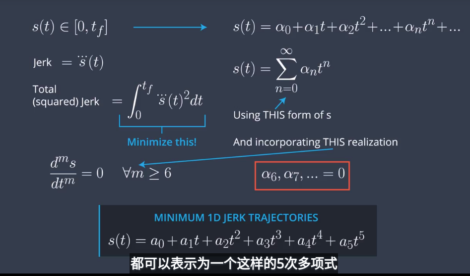
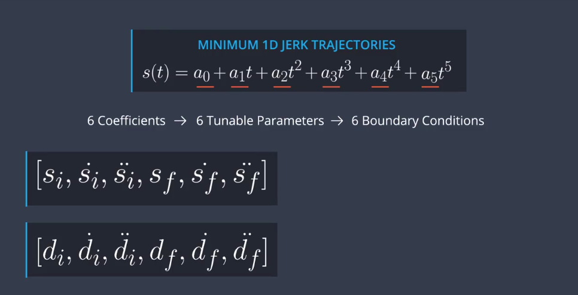
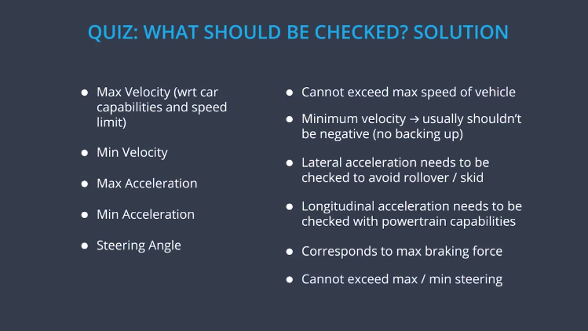
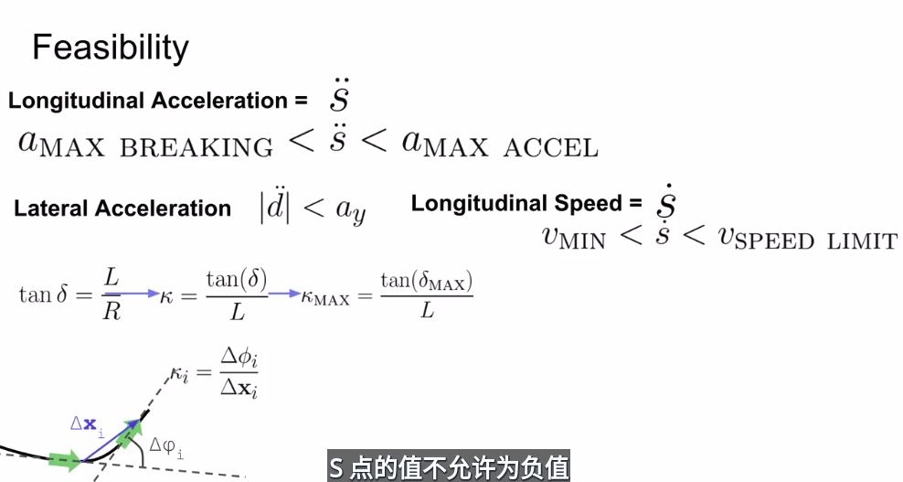
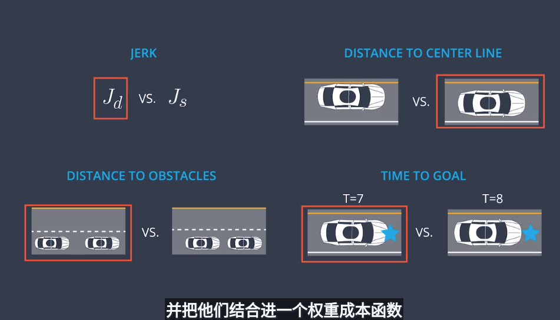

### 路径生成

- overview


- 运动规划问题

  > 可行的运动规划：在配置空间中找到一个运行序列，从开始位置移动到目标位置，没有碰撞到任何的障碍物。

  

- 运动规划算法属性

  > 完备性
  >
  > 最优解

  

- 运动规划算法

  > 下面介绍了四种运动规划的算法

  

- 基于采样的方法

  

- A*

  > 生成的路径只是坐标值，可能有一些急转弯等情况，不能确定一定使可行驶的。
  >
  > 离散化越严重，得出的解越好。

  

- 混合A*算法

  > 机器人的世界是连续的，A*是离散的。
  >
  > 混合A*算法就是为了解决这个连续性问题。它是连续的能保证路径是可以行驶的，但是丢失了完备性。

  

- 混合A*实践

  > 下图中只使用了三个方向值，如果转向大小很多，模型会很复杂。

  

  在网格中的连续运动

  

  注意：可能生成的路径没有人工的那么平滑，或则有些时候找不到最优解。例如：

  

- 混合A*伪代码

  - `State(x, y, theta, g, f)`: An object which stores `x`, `y` coordinates, direction `theta`, and current `g` and `f` values. grid: A 2D array of 0s and 1s indicating the area to be searched. 1s correspond to obstacles, and 0s correspond to free space.
  - `SPEED`: The speed of the vehicle used in the bicycle model.
  - `LENGTH`: The length of the vehicle used in the bicycle model.
  - `NUM_THETA_CELLS`: The number of cells a circle is divided into. This is used in keeping track of which States we have visited already.

  > The bulk of the hybrid A* algorithm is contained within the `search` function. The `expand` function takes a state and goal as inputs and returns a list of possible next states for a range of steering angles. This function contains the implementation of the bicycle model and the call to the A* heuristic function.

  ```python
  def expand(state, goal):
      next_states = []
      for delta in range(-35, 40, 5): 
          # Create a trajectory with delta as the steering angle using the bicycle model:

          # ---Begin bicycle model---
          delta_rad = deg_to_rad(delta)
          omega = SPEED/LENGTH * tan(delta_rad)
          next_x = state.x + SPEED * cos(theta)
          next_y = state.y + SPEED * sin(theta)
          next_theta = normalize(state.theta + omega)
          # ---End bicycle model-----

          next_g = state.g + 1
          next_f = next_g + heuristic(next_x, next_y, goal)

          # Create a new State object with all of the "next" values.
          state = State(next_x, next_y, next_theta, next_g, next_f)
          next_states.append(state)

      return next_states

  def search(grid, start, goal):
      # The opened array keeps track of the stack of States objects we are 
      # searching through.
      opened = []
      # 3D array of zeros with dimensions:
      # (NUM_THETA_CELLS, grid x size, grid y size).
      closed = [[[0 for x in range(grid[0])] for y in range(len(grid))] for cell in range(NUM_THETA_CELLS)]
      # 3D array with same dimensions. Will be filled with State() objects to keep 
      # track of the path through the grid. 
      came_from = [[[0 for x in range(grid[0])] for y in range(len(grid))] for cell in range(NUM_THETA_CELLS)]

      # Create new state object to start the search with.
      x = start.x
      y = start.y
      theta = start.theta
      g = 0
      f = heuristic(start.x, start.y, goal)
      state = State(x, y, theta, 0, f)
      opened.append(state)

      # The range from 0 to 2pi has been discretized into NUM_THETA_CELLS cells. 
      # Here, theta_to_stack_number returns the cell that theta belongs to. 
      # Smaller thetas (close to 0 when normalized  into the range from 0 to 2pi) 
      # have lower stack numbers, and larger thetas (close to 2pi whe normalized)
      # have larger stack numbers.
      stack_number = theta_to_stack_number(state.theta)
      closed[stack_number][index(state.x)][index(state.y)] = 1

      # Store our starting state. For other states, we will store the previous state 
      # in the path, but the starting state has no previous.
      came_from[stack_number][index(state.x)][index(state.y)] = state

      # While there are still states to explore:
      while opened:
          # Sort the states by f-value and start search using the state with the 
          # lowest f-value. This is crucial to the A* algorithm; the f-value 
          # improves search efficiency by indicating where to look first.
          opened.sort(key=lambda state:state.f)
          current = opened.pop(0)

          # Check if the x and y coordinates are in the same grid cell as the goal. 
          # (Note: The idx function returns the grid index for a given coordinate.)
          if (idx(current.x) == goal[0]) and (idx(current.y) == goal.y):
              # If so, the trajectory has reached the goal.
              return path

          # Otherwise, expand the current state to get a list of possible next states.
          next_states = expand(current, goal)
          for next_state in next_states:
              # If we have expanded outside the grid, skip this next_state.
              if next_states is not in the grid:
                  continue
              # Otherwise, check that we haven't already visited this cell and
              # that there is not an obstacle in the grid there.
              stack_number = theta_to_stack_number(next_state.theta)
              if closed_value[stack_number][idx(next_state.x)][idx(next_state.y)] == 0 and grid[idx(next_state.x)][idx(next_state.y)] == 0:
                  # The state can be added to the opened stack.
                  opened.append(next_state)
                  # The stack_number, idx(next_state.x), idx(next_state.y) tuple 
                  # has now been visited, so it can be closed.
                  closed[stack_number][idx(next_state.x)][idx(next_state.y)] = 1
                  # The next_state came from the current state, and that is recorded.
                  came_from[stack_number][idx(next_state.x)][idx(next_state.y)] = current
  ```

- 环境分类

  > 停车场和迷宫是属于非机构化环境，很少明确的规定和速度很低，找不到一条９０％的车都会这样行驶的路径。
  >
  > 高速路和街道上有明确的规定，比如形式的方向，车道边界，速度限制，并且车道结构直接可以直接使用于参考路线。

  

- Frenet坐标存在的问题

  > 需要加入时间维度，必须确定什么时间在哪个位置上，因为道路上的车辆是在随时变化的。
  >
  > 下面的第四条，是说在笛卡尔坐标系也会存在相同的问题—需要时间维度。

  

- 加入时间维度

  > 因为三维不能很好的可视化，展示成两个二维坐标，分别是ｓ随时间的变化和ｄ随时间的变化。

  

- 结构化轨迹生成预览

  > 该方法适用于固定环境，比如高速路

  

- 如果确定了起点和终点去规划路径，像下图这样是不可取的，因为在拐点的变化很大，需要很大加速度才可以

  这样乘客会感受到很不舒适，所以规划出的路线需要是平滑的、连续的。

  

- 什么情况下会让乘客感觉到不舒服

  > 答案是颠簸（加速度忽快忽慢不停的变化，车辆时快时慢，会让乘客感受到很不舒服）通过求得加速度的导数求得颠簸的大小。
  >
  > 位移－>速度－>加速度－>急刹车－>急停－>急转->跳跃

  

- 最小化一维情况下的的Jerk路径

  

  > 上图的6个参数其实就是６个边界条件，这六个条件为位移，速度，加速度

  

- 导数概览

  

  > 在网上找到的一篇比较好的博客介绍“Jerk最小化”
  >
  > https://blog.csdn.net/adamshan/article/details/80779615

- 测试

  ```C
  #include <iostream>
  #include <fstream>
  #include <cmath>
  #include <vector>

  #include "Dense"

  using namespace std;
  using Eigen::MatrixXd;
  using Eigen::VectorXd;

  // TODO - complete this function
  vector<double> JMT(vector< double> start, vector <double> end, double T)
  {
      /*
      Calculate the Jerk Minimizing Trajectory that connects the initial state
      to the final state in time T.

      INPUTS

      start - the vehicles start location given as a length three array
          corresponding to initial values of [s, s_dot, s_double_dot]

      end   - the desired end state for vehicle. Like "start" this is a
          length three array.

      T     - The duration, in seconds, over which this maneuver should occur.

      OUTPUT 
      an array of length 6, each value corresponding to a coefficent in the polynomial 
      s(t) = a_0 + a_1 * t + a_2 * t**2 + a_3 * t**3 + a_4 * t**4 + a_5 * t**5

      EXAMPLE

      > JMT( [0, 10, 0], [10, 10, 0], 1)
      [0.0, 10.0, 0.0, 0.0, 0.0, 0.0]
      */
      return {1,2,3,4,5,6};
      
  }

  bool close_enough(vector< double > poly, vector<double> target_poly, double eps=0.01) {


  	if(poly.size() != target_poly.size())
  	{
  		cout << "your solution didn't have the correct number of terms" << endl;
  		return false;
  	}
  	for(int i = 0; i < poly.size(); i++)
  	{
  		double diff = poly[i]-target_poly[i];
  		if(abs(diff) > eps)
  		{
  			cout << "at least one of your terms differed from target by more than " << eps << endl;
  			return false;
  		}

  	}
  	return true;
  }
  	
  struct test_case {
  	
  		vector<double> start;
  		vector<double> end;
  		double T;
  };

  vector< vector<double> > answers = {{0.0, 10.0, 0.0, 0.0, 0.0, 0.0},{0.0,10.0,0.0,0.0,-0.625,0.3125},{5.0,10.0,1.0,-3.0,0.64,-0.0432}};

  int main() {

  	//create test cases

  	vector< test_case > tc;

  	test_case tc1;
  	tc1.start = {0,10,0};
  	tc1.end = {10,10,0};
  	tc1.T = 1;
  	tc.push_back(tc1);

  	test_case tc2;
  	tc2.start = {0,10,0};
  	tc2.end = {20,15,20};
  	tc2.T = 2;
  	tc.push_back(tc2);

  	test_case tc3;
  	tc3.start = {5,10,2};
  	tc3.end = {-30,-20,-4};
  	tc3.T = 5;
  	tc.push_back(tc3);

  	bool total_correct = true;
  	for(int i = 0; i < tc.size(); i++)
  	{
  		vector< double > jmt = JMT(tc[i].start, tc[i].end, tc[i].T);
  		bool correct = close_enough(jmt,answers[i]);
  		total_correct &= correct;

  	}
  	if(!total_correct)
  	{
  		cout << "Try again!" << endl;
  	}
  	else
  	{
  		cout << "Nice work!" << endl;
  	}

  	return 0;
  }
  ```

- 一条潜在可行的路径可能需要考虑的问题

  

- 可行性实现

  

  ​

- 因为算法每次会生成多条轨迹，需要从其中找出最好的一条轨迹，需要考虑的损失有。

  

  ​