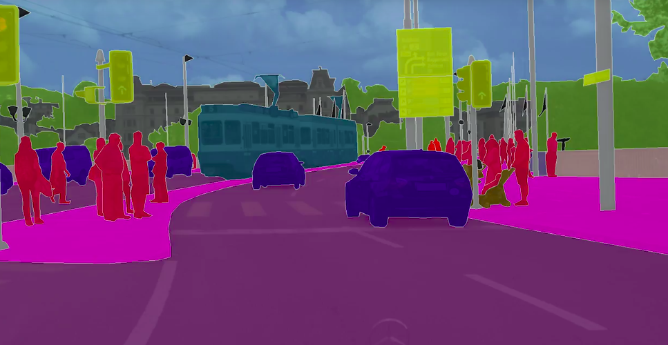
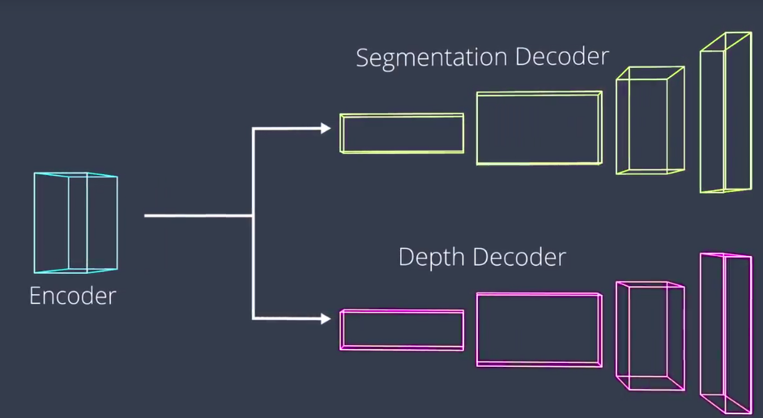

- 语义分割获取图像的每个有像素信息，而不是给识别的物体添加边框。

  

- 一种场景理解的方法是训练多个解码器，比如一个用于分割，一个用于深度测量。

  

- IOU

  > 通常用于测量模型在语义分割上的性能

  Let's walk through an example IOU calculation.

  ## Steps

  - count true positives (TP)
  - count false positives (FP)
  - count false negatives (TN)
  - Intersection = TP
  - Union = TP + FP + FN
  - IOU = Intersection/Union

  

  

  **Mean IOU = [(3/7) + (2/6) + (3/4) + (1/6) ]/4 = 0.420**

- ​