## 1. 定位

- 无人车定位的精度范围需要限制在10厘米以内，但是GPS的定位精度误差在10—50米范围不等，所以仅仅依靠GPS是不够的，还需要使用传感器和全球高精度地图进行定位。把观察的参照物和高精度地图比照，如果配对成功，把自己的坐标系转换为全球高精度坐标系，确定自己的位置。

- 一维世界的定位模型

  > 假设现实世界有三扇门，刚开始时机器人在任何地点的概率是相等的，通过第一次观察到门，三个有门的地方的概率提升（有门的地方乘以大的数，没有门的地方乘以小的数，计算完成后再归一化处理，使得概率和为1，其实就是贝叶斯运算），机器人向前再走一步，由于机器人移动的距离可能并不是很准确，所以需要对概率模型进行卷积运算（全概率），然后再次观察，发现有门，则第二个门的概率又提升。所以定位到第二个门的位置。
  >
  > **总结：首先要有一个概率分布，机器人观察物体更新概率分布，移动物体对概率分布进行滤波处理**

  

  > 下边展示的是上述观察更新用到的贝叶斯公式：
  >
  > p(x)表示先验概率，p(z|x)表示测量后得到的的值，例如：观察到红色乘以0.6观察到绿色乘以0.2

  

  > 如下展示的是上述运动更新概率分布时用到的全概率公式：

  

  代码展示：

  ```python
  #Given the list motions=[1,1] which means the robot 
  #moves right and then right again, compute the posterior 
  #distribution if the robot first senses red, then moves 
  #right one, then senses green, then moves right again, 
  #starting with a uniform prior distribution.

  p=[0.2, 0.2, 0.2, 0.2, 0.2]
  world=['green', 'red', 'red', 'green', 'green']
  measurements = ['red', 'green']
  motions = [1,1]
  pHit = 0.6
  pMiss = 0.2
  pExact = 0.8
  pOvershoot = 0.1
  pUndershoot = 0.1

  def sense(p, Z):
      """
      对机器人人所在的环境进行感知，根据观察到的值，更新概率分布
      """
      q=[]
      for i in range(len(p)):
          hit = (Z == world[i])
          q.append(p[i] * (hit * pHit + (1-hit) * pMiss))
      s = sum(q)
      for i in range(len(q)):
          q[i] = q[i] / s
      return q

  def move(p, U):
      """
      移动机器人时使用全概率公式更新概率分布
      """
      q = []
      for i in range(len(p)):
          s = pExact * p[(i-U) % len(p)]
          s = s + pOvershoot * p[(i-U-1) % len(p)]
          s = s + pUndershoot * p[(i-U+1) % len(p)]
          q.append(s)
      return q

  for i in range(2):
      p = sense(p, measurements[i])
      p = move(p, motions[i])

  print p  
  ```


## 2. 马尔可夫定位

- 使用普通的贝叶斯定位，六个小时积累的数据量

  > 如果使用普通的贝叶斯概率模型，数据量太大

  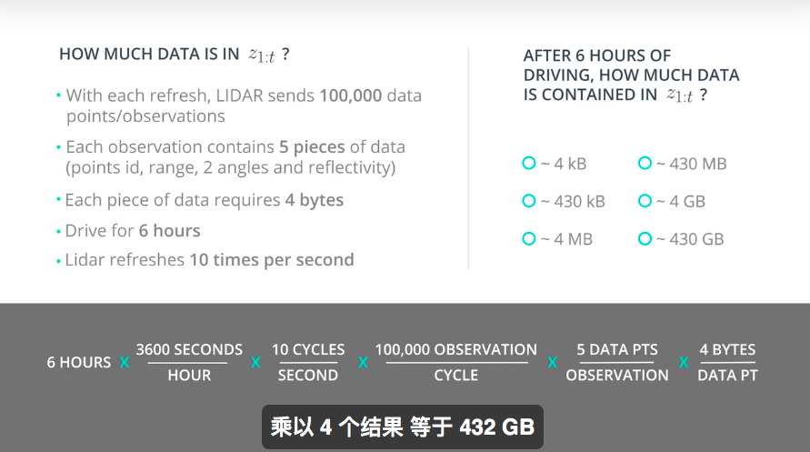

- 使用马尔可夫定位可以解决如上的问题

  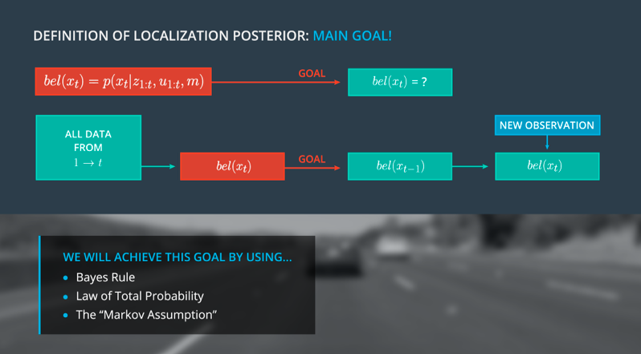


## 3. 运动模型

- 自行车模型

  > 不考虑车辆在垂直方向上的运动，只考虑车辆在二维平面的运动，因为测量的前后轮是联动的，所以前轮和后轮可以分别简化为一个轮子的运动。

  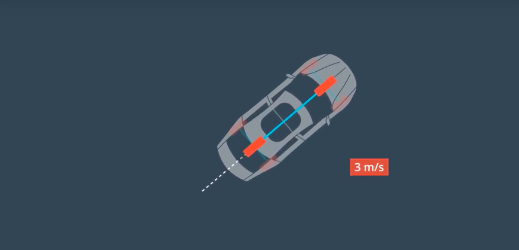

- 角速度和速率

  > 这是之前在传感器融合部分的CTRV模型，当角速度和0和不为0的时候，偏航角和速度的更新过程。

  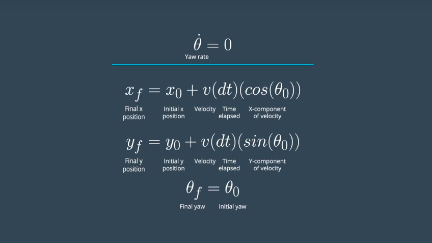   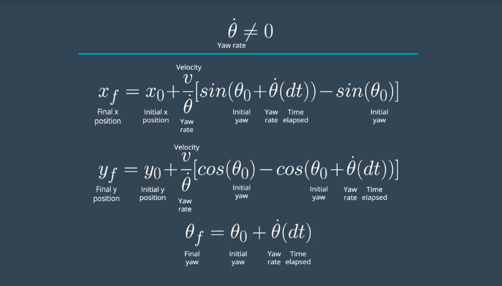

- 定位 VS 传感器融合

  ​	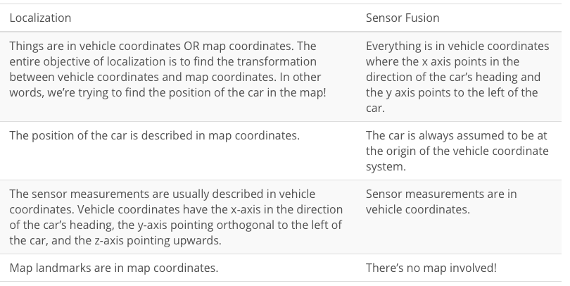

- Roll Pitch 和Yaw

  >  Yaw:绕z轴的旋转角度。
  >
  > Roll:绕x轴的旋转角度。
  >
  > Pitch:绕y轴的旋转角度。
  >
  > 注意：如果是比较平的地方，我们只考虑Yaw就可以了，在一些比较陡峭的地方我们需要考虑Roll和Pitch。

- Odometry

  > 使用轮子上的传感器，测量轮胎旋转的圈数。从而确定车辆的行驶距离。
  >
  > **注意：在路面潮湿和凹凸不平的路面进行行驶的时候，会有误差。但是在弯道行驶不会影响距离的测量。**

  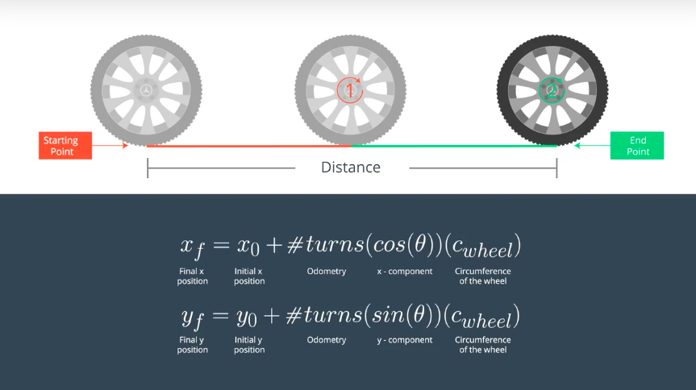


## 4. 粒子滤波

- 直方图滤波，卡尔曼滤波和粒子滤波的对比

  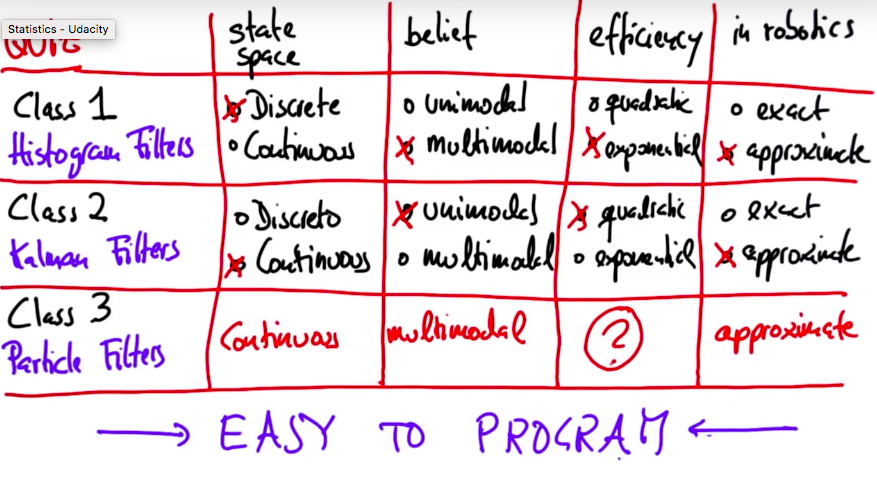

- 机器人世界

  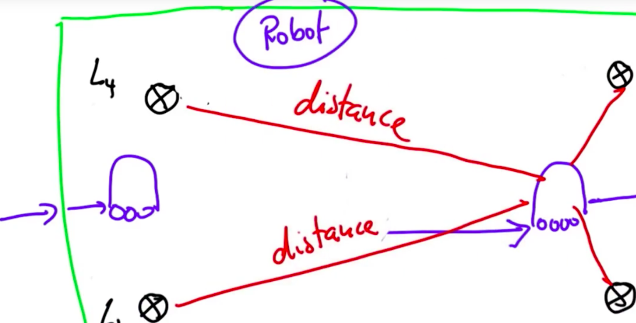


- 随机生成1000个粒子向量

  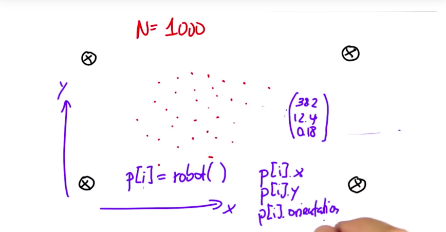示例代码：

  ```python
  N = 1000
  p = []

  #enter code here
  for i in range(1000):
      p.append(robot())

  print len(p)
  ```

  遍历每一个粒子向量，方向0.1移动5

  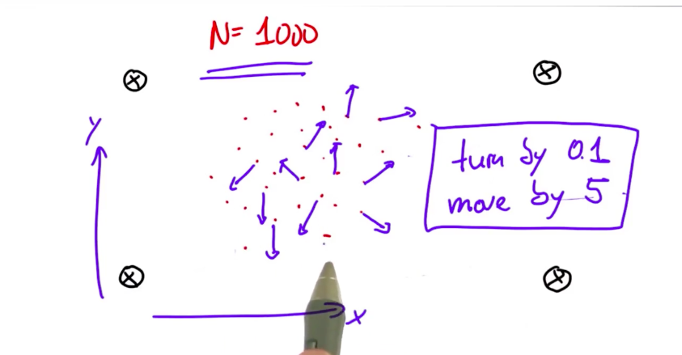示例代码：

  ```python
  for i in range(N):
      x = p[i]
      p[i] =  x.move(0.1, 5)
  ```

- 给每一个粒子设置一个权重（重采样，很重要）

  > 中间的蓝点色圆圈表示机器人所在的位置，红色圆圈表示粒子在的位置的权重大小，越大表示权重越大，越小，权重越小。

  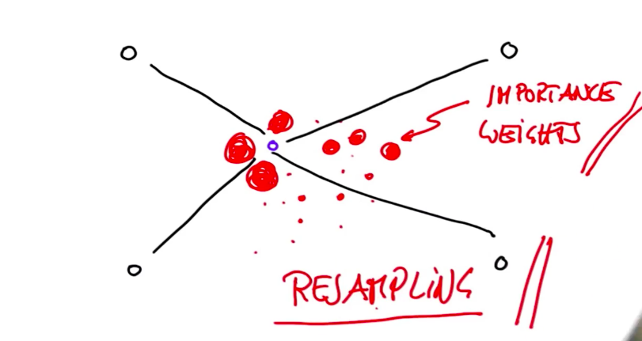

  > 权重的计算方式：根据机器人的测量值和粒子的值进行对比，匹配程度越高的权重越大，匹配度越小的概率越小。
  >
  > 重采样：根据计算出的每一个粒子的概率，重新取样替换粒子列表数据，权重大的粒子可能会重复取到，权重小的粒子可能被淘汰掉。

  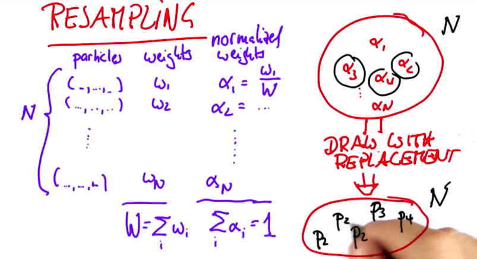

  > 重采样轮子，重采样的算法

  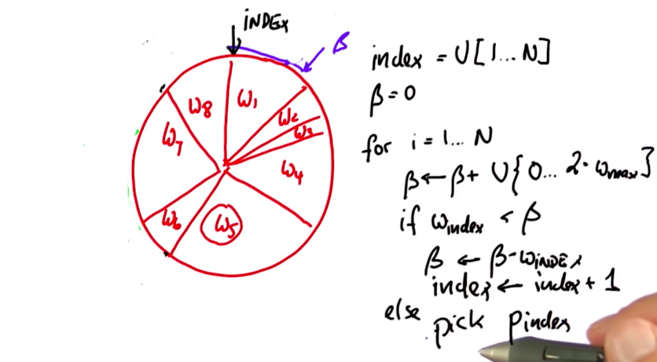

  > 数学定义

  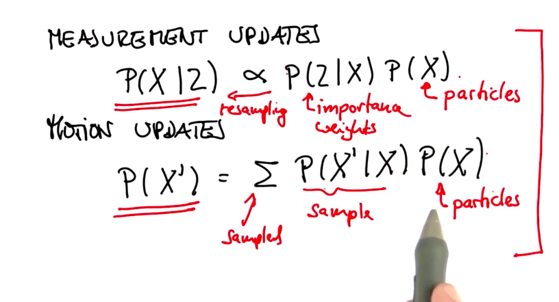

  ​