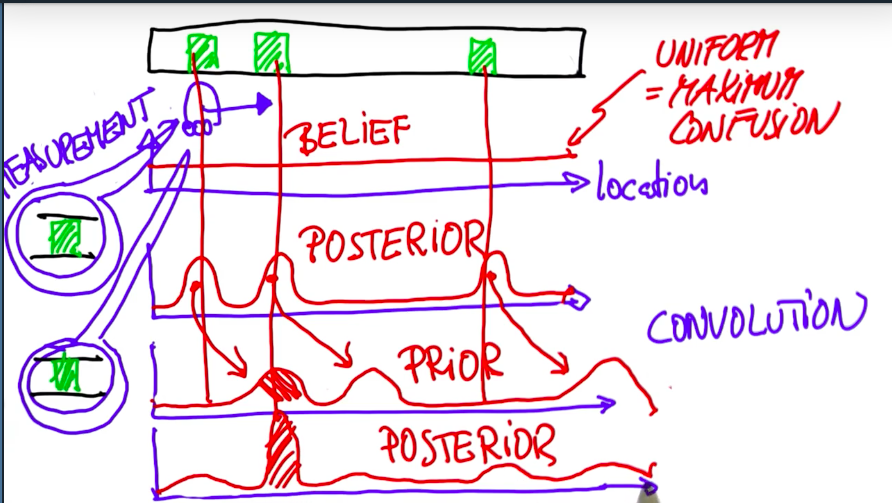
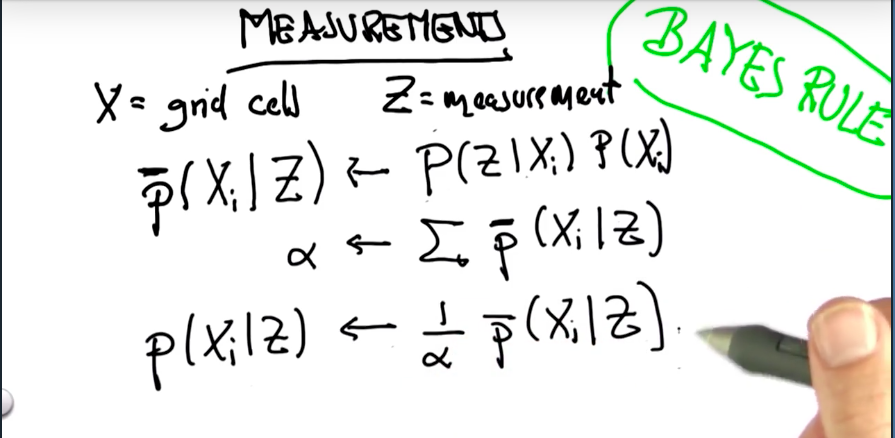
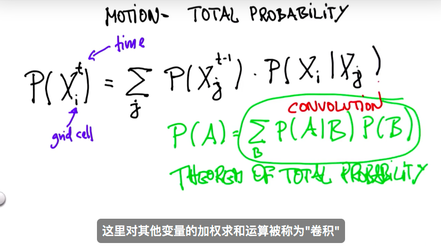

- 无人车定位的精度范围需要限制在10厘米以内，但是GPS的定位精度误差在10—50米范围不等，所以仅仅依靠GPS是不够的，还需要使用传感器和全球高精度地图进行定位。把观察的参照物和高精度地图比照，如果配对成功，把自己的坐标系转换为全球高精度坐标系，确定自己的位置。

- 一维世界的定位模型

  > 假设现实世界有三扇门，刚开始时机器人在任何地点的概率是相等的，通过第一次观察到门，三个有门的地方的概率提升（有门的地方乘以大的数，没有门的地方乘以小的数，计算完成后再归一化处理，使得概率和为1，其实就是贝叶斯运算），机器人向前再走一步，由于机器人移动的距离可能并不是很准确，所以需要对概率模型进行卷积运算（全概率），然后再次观察，发现有门，则第二个门的概率又提升。所以定位到第二个门的位置。
  >
  > **总结：首先要有一个概率分布，机器人观察物体更新概率分布，移动物体对概率分布进行滤波处理**

  

  > 下边展示的是上述观察更新用到的贝叶斯公式：
  >
  > p(x)表示先验概率，p(z|x)表示测量后得到的的值，例如：观察到红色乘以0.6观察到绿色乘以0.2

  

  > 如下展示的是上述运动更新概率分布时用到的全概率公式：

  

  代码展示：

  ```python
  #Given the list motions=[1,1] which means the robot 
  #moves right and then right again, compute the posterior 
  #distribution if the robot first senses red, then moves 
  #right one, then senses green, then moves right again, 
  #starting with a uniform prior distribution.

  p=[0.2, 0.2, 0.2, 0.2, 0.2]
  world=['green', 'red', 'red', 'green', 'green']
  measurements = ['red', 'green']
  motions = [1,1]
  pHit = 0.6
  pMiss = 0.2
  pExact = 0.8
  pOvershoot = 0.1
  pUndershoot = 0.1

  def sense(p, Z):
      """
      对机器人人所在的环境进行感知，根据观察到的值，更新概率分布
      """
      q=[]
      for i in range(len(p)):
          hit = (Z == world[i])
          q.append(p[i] * (hit * pHit + (1-hit) * pMiss))
      s = sum(q)
      for i in range(len(q)):
          q[i] = q[i] / s
      return q

  def move(p, U):
      """
      移动机器人时使用全概率公式更新概率分布
      """
      q = []
      for i in range(len(p)):
          s = pExact * p[(i-U) % len(p)]
          s = s + pOvershoot * p[(i-U-1) % len(p)]
          s = s + pUndershoot * p[(i-U+1) % len(p)]
          q.append(s)
      return q

  for i in range(2):
      p = sense(p, measurements[i])
      p = move(p, motions[i])

  print p  
  ```
  ​

  ​


