## 1. 定位

- 无人车定位的精度范围需要限制在10厘米以内，但是GPS的定位精度误差在10—50米范围不等，所以仅仅依靠GPS是不够的，还需要使用传感器和全球高精度地图进行定位。把观察的参照物和高精度地图比照，如果配对成功，把自己的坐标系转换为全球高精度坐标系，确定自己的位置。

- 一维世界的定位模型

  > 假设现实世界有三扇门，刚开始时机器人在任何地点的概率是相等的，通过第一次观察到门，三个有门的地方的概率提升（有门的地方乘以大的数，没有门的地方乘以小的数，计算完成后再归一化处理，使得概率和为1，其实就是贝叶斯运算），机器人向前再走一步，由于机器人移动的距离可能并不是很准确，所以需要对概率模型进行卷积运算（全概率），然后再次观察，发现有门，则第二个门的概率又提升。所以定位到第二个门的位置。
  >
  > **总结：首先要有一个概率分布，机器人观察物体更新概率分布，移动物体对概率分布进行滤波处理**

  

  > 下边展示的是上述观察更新用到的贝叶斯公式：
  >
  > p(x)表示先验概率，p(z|x)表示测量后得到的的值，例如：观察到红色乘以0.6观察到绿色乘以0.2

  

  > 如下展示的是上述运动更新概率分布时用到的全概率公式：

  

  代码展示：

  ```python
  #Given the list motions=[1,1] which means the robot 
  #moves right and then right again, compute the posterior 
  #distribution if the robot first senses red, then moves 
  #right one, then senses green, then moves right again, 
  #starting with a uniform prior distribution.

  p=[0.2, 0.2, 0.2, 0.2, 0.2]
  world=['green', 'red', 'red', 'green', 'green']
  measurements = ['red', 'green']
  motions = [1,1]
  pHit = 0.6
  pMiss = 0.2
  pExact = 0.8
  pOvershoot = 0.1
  pUndershoot = 0.1

  def sense(p, Z):
      """
      对机器人人所在的环境进行感知，根据观察到的值，更新概率分布
      """
      q=[]
      for i in range(len(p)):
          hit = (Z == world[i])
          q.append(p[i] * (hit * pHit + (1-hit) * pMiss))
      s = sum(q)
      for i in range(len(q)):
          q[i] = q[i] / s
      return q

  def move(p, U):
      """
      移动机器人时使用全概率公式更新概率分布
      """
      q = []
      for i in range(len(p)):
          s = pExact * p[(i-U) % len(p)]
          s = s + pOvershoot * p[(i-U-1) % len(p)]
          s = s + pUndershoot * p[(i-U+1) % len(p)]
          q.append(s)
      return q

  for i in range(2):
      p = sense(p, measurements[i])
      p = move(p, motions[i])

  print p  
  ```


## 2. 马尔可夫定位

- 使用普通的贝叶斯定位，六个小时积累的数据量

  > 如果使用普通的贝叶斯概率模型，数据量太大

  

- 我们必须解决两个问题

  1. 每一次的测量更新都需要从大量的数据进行计算，这对于实时定位是行不通的。
  2. 数据量是随时间递增的，会越来越大。

- 使用贝叶斯定位滤波或马尔可夫定位可以解决如上的问题

  > 当前的信仰bel(xt)可以通过前一个的信仰bel(xt-1)来表达，然后使用新的观察数据去更新当前的信仰。这样递归的进行。要实现这个需要用到：
  >
  > 1. 贝叶斯概率，
  > 2. 全概率
  > 3. 马尔可夫假设。

  

  需要预测的后验概率，注意：这个地方把z1:t写成了最z1,zt-1：

  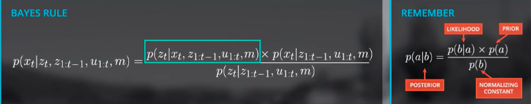

  注意到去掉后面的相似部分，其实就是常用的贝叶斯公式：

  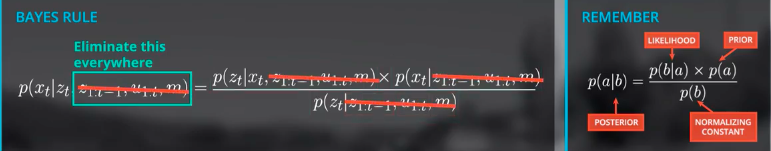

  为了简化模型，把归一化项记为η:

  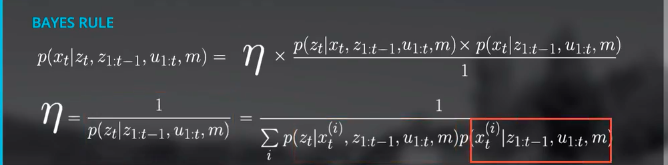

  计算先验概率p(xt|z1:t-1, u1, m)，运动模型，和sebastian所讲的卷积是一样的，使用全概率公式（连续的使用积分，不连续使用累加和）：

  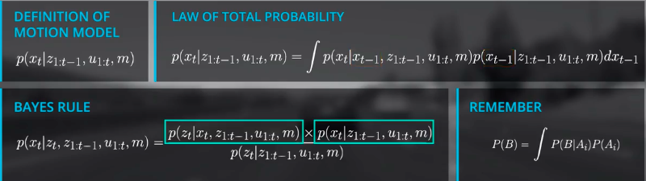

  根据如上公式，使用图表示这种关系:

  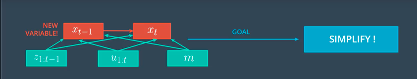

  马尔可夫假设：

  1. 因为我们已经知道xt-1状态，过去的观察z1:t-1和u1:t-1将不会提供更多的信息去预测xt，假设当前状态xt只和上一个状态xt-1相关，从而实现了递归的结构，所以p(xt|xt-1，z1:t-1, u1:t, m)可以简化为p(xt|xt-1, zt, ut,  m)。
  2. 因为预测xt-1的时候，还不知道ut，所以p(xt-1|z1:t-1, u1:t, m)可以简化为p(xt-1|z1:t-1, u1:t-1, m)。

  简化后的模型图：

  

  递归结构：

  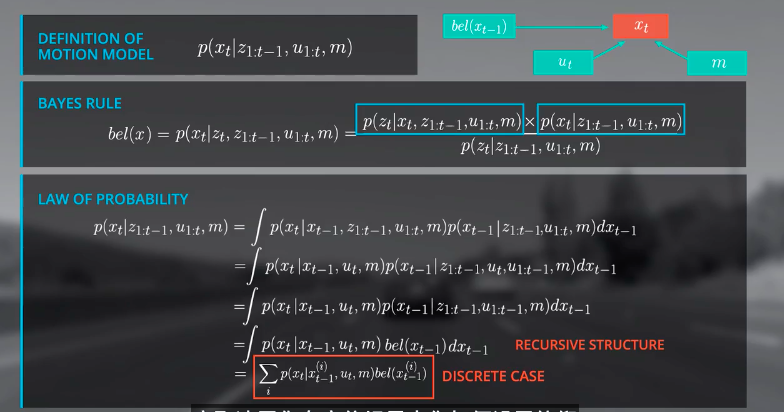

  一些细节：

  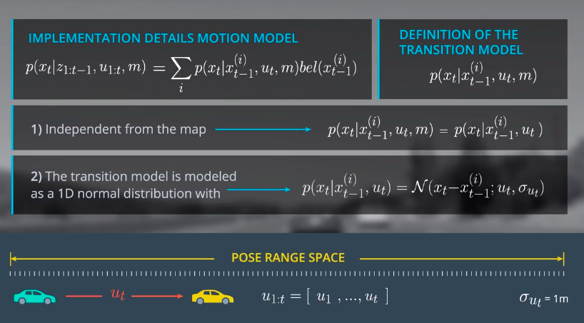

-  normalized probability density function (PDF)

  ```c++
  //=================================================================================
  // Name        : help_functions.h
  // Version     : 2.0.0
  // Copyright   : Udacity
  //=================================================================================

  #ifndef HELP_FUNCTIONS_H_
  #define HELP_FUNCTIONS_H_

  #include <math.h>
  #include <iostream>
  #include <vector>

  using namespace std;

  class Helpers {
  public:

  	//definition of one over square root of 2*pi:
  	constexpr static float STATIC_ONE_OVER_SQRT_2PI = 1/sqrt(2*M_PI) ;
  	float ONE_OVER_SQRT_2PI = 1/sqrt(2*M_PI) ;

  	/*****************************************************************************
  	 * normpdf(X,mu,sigma) computes the probability function at values x using the
  	 * normal distribution with mean mu and standard deviation std. x, mue and 
  	 * sigma must be scalar! The parameter std must be positive. 
  	 * The normal pdf is y=f(x;mu,std)= 1/(std*sqrt(2pi)) e[ -(x−mu)^2 / 2*std^2 ]
  	*****************************************************************************/
  	static float normpdf(float x, float mu, float std) {
  	    return (STATIC_ONE_OVER_SQRT_2PI/std)*exp(-0.5*pow((x-mu)/std,2));
  	}
  	
  };

  #endif /* HELP_FUNCTIONS_H_ */
  ```

- 运动模型，也是预测模型（根据上一步xt-1每一个位置的先验值和高斯分布，通过卷积运算，计算下一步xt每一个位置状态值，其实和之前sebastian讲的卷积运算是一样的）

  ```c++
  #include <iostream>
  #include <algorithm>
  #include <vector>

  #include "helpers.h"
  using namespace std;

  std::vector<float> initialize_priors(int map_size, std::vector<float> landmark_positions, float position_stdev);

  float motion_model(float pseudo_position, float movement, std::vector<float> priors,
                     int map_size, int control_stdev);

  int main() {
      
      //set standard deviation of control:
      float control_stdev = 1.0f;
      
      //set standard deviation of position:
      float position_stdev = 1.0f;

      //meters vehicle moves per time step
      float movement_per_timestep = 1.0f;

      //number of x positions on map
      int map_size = 25;

      //initialize landmarks
      std::vector<float> landmark_positions {5, 10, 20};
      
      // initialize priors
      std::vector<float> priors = initialize_priors(map_size, landmark_positions,
                                                    position_stdev);
      
      //step through each pseudo position x (i)    
      for (unsigned int i = 0; i < map_size; ++i) {
          float pseudo_position = float(i);

          //get the motion model probability for each x position
          float motion_prob = motion_model(pseudo_position, movement_per_timestep,
                              priors, map_size, control_stdev);
          
          //print to stdout
          std::cout << pseudo_position << "\t" << motion_prob << endl;
      }    

      return 0;
  };

  //TODO, implement the motion model: calculates prob of being at an estimated position at time t
  float motion_model(float pseudo_position, float movement, std::vector<float> priors,
                     int map_size, int control_stdev) {

      //initialize probability
      float position_prob = 0.0f;
      
      //YOUR CODE HERE
      for (int i=0;i<map_size;i++){
          float next_position = float(i);
          float distance = pseudo_position-next_position;
          float transition_prob = Helpers::normpdf(distance,movement,control_stdev);
          position_prob += transition_prob * priors[i];
           
      }
      return position_prob;
  }

  //initialize priors assumimg vehicle at landmark +/- 1.0 meters position stdev
  std::vector<float> initialize_priors(int map_size, std::vector<float> landmark_positions,
                                       float position_stdev) {
  //initialize priors assumimg vehicle at landmark +/- 1.0 meters position stdev

      //set all priors to 0.0
      std::vector<float> priors(map_size, 0.0);

      //set each landmark positon +/1 to 1.0/9.0 (9 possible postions)
      float normalization_term = landmark_positions.size() * (position_stdev * 2 + 1);
      for (unsigned int i = 0; i < landmark_positions.size(); i++){
          int landmark_center = landmark_positions[i];
          priors[landmark_center] = 1.0f/normalization_term;
          priors[landmark_center - 1] = 1.0f/normalization_term;
          priors[landmark_center + 1] = 1.0f/normalization_term;
      }
      return priors;
  }
  ```

- 观察模型

  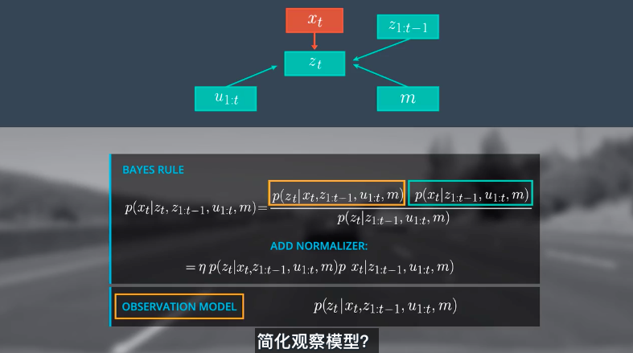

- 使用马尔可夫假设，简化观察模型

  > 使用马尔可夫假设，简化后的观察模型仅仅依赖xt和m。
  >
  > 同时，假设各个观测之间是相互独立的，则呢一写成概率相乘的形式。

  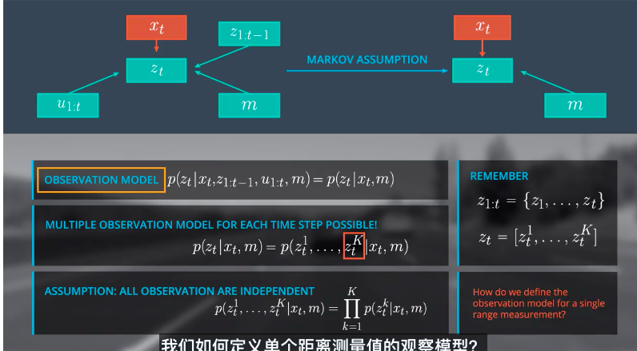

- 整合

  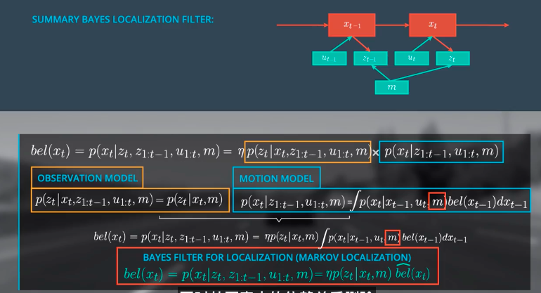

- 观察模型概率计算

  > zt表示绿色的车检测到树和路灯的距离。
  >
  > zt*表示黄色的车在地图上到树和路灯的距离。
  >
  > 观察可以对比看出，车的位置应该在40的位置，而不是在20的位置。

  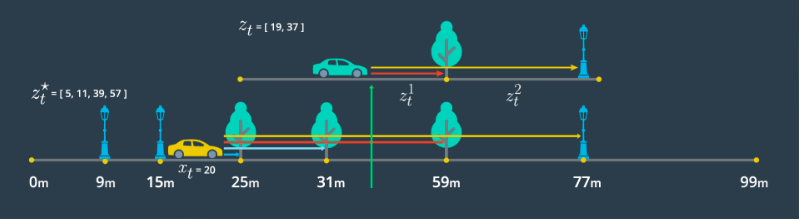

- 观测模型的实现流程

  1. 测量在100米范围内，车辆前进的方向的地标，zt。
  2. 计算在地图上，地标的位置减去车的当前位置，获得伪距离，zt*。
  3. 匹配每一个伪距离范围和，Match each pseudo range estimate to its closest observation measurement
  4. 对于每一个为距离和观察测量对, calculate a probability by passing relevant values to norm_pdf: `norm_pdf(observation_measurement, pseudo_range_estimate, observation_stdev)`
  5. 返回概率的乘积。


## 3. 运动模型

- 自行车模型

  > 不考虑车辆在垂直方向上的运动，只考虑车辆在二维平面的运动，因为测量的前后轮是联动的，所以前轮和后轮可以分别简化为一个轮子的运动。

  

- 角速度和速率

  > 这是之前在传感器融合部分的CTRV模型，当角速度和0和不为0的时候，偏航角和速度的更新过程。

     

- 定位 VS 传感器融合

  ​	

- Roll Pitch 和Yaw

  >  Yaw:绕z轴的旋转角度。
  >
  > Roll:绕x轴的旋转角度。
  >
  > Pitch:绕y轴的旋转角度。
  >
  > 注意：如果是比较平的地方，我们只考虑Yaw就可以了，在一些比较陡峭的地方我们需要考虑Roll和Pitch。

- Odometry

  > 使用轮子上的传感器，测量轮胎旋转的圈数。从而确定车辆的行驶距离。
  >
  > **注意：在路面潮湿和凹凸不平的路面进行行驶的时候，会有误差。但是在弯道行驶不会影响距离的测量。**

  


## 4. 粒子滤波

- 直方图滤波，卡尔曼滤波和粒子滤波的对比

  

- 机器人世界

  


- 随机生成1000个粒子向量

  示例代码：

  ```python
  N = 1000
  p = []

  #enter code here
  for i in range(1000):
      p.append(robot())

  print len(p)
  ```

  遍历每一个粒子向量，方向0.1移动5

  示例代码：

  ```python
  for i in range(N):
      x = p[i]
      p[i] =  x.move(0.1, 5)
  ```

- 给每一个粒子设置一个权重（重采样，很重要）

  > 中间的蓝点色圆圈表示机器人所在的位置，红色圆圈表示粒子在的位置的权重大小，越大表示权重越大，越小，权重越小。

  

  > 权重的计算方式：根据机器人的测量值和粒子的值进行对比，匹配程度越高的权重越大，匹配度越小的概率越小。
  >
  > 重采样：根据计算出的每一个粒子的概率，重新取样替换粒子列表数据，权重大的粒子可能会重复取到，权重小的粒子可能被淘汰掉。

  

  > 重采样轮子，重采样的算法

  

  > 数学定义

  

  代码

  ```python
  # Please only modify the indicated area below!

  from math import *
  import random

  landmarks  = [[20.0, 20.0], [80.0, 80.0], [20.0, 80.0], [80.0, 20.0]]
  world_size = 100.0

  class robot:
      def __init__(self):
          self.x = random.random() * world_size
          self.y = random.random() * world_size
          self.orientation = random.random() * 2.0 * pi
          self.forward_noise = 0.0;
          self.turn_noise    = 0.0;
          self.sense_noise   = 0.0;
      
      def set(self, new_x, new_y, new_orientation):
          if new_x < 0 or new_x >= world_size:
              raise ValueError, 'X coordinate out of bound'
          if new_y < 0 or new_y >= world_size:
              raise ValueError, 'Y coordinate out of bound'
          if new_orientation < 0 or new_orientation >= 2 * pi:
              raise ValueError, 'Orientation must be in [0..2pi]'
          self.x = float(new_x)
          self.y = float(new_y)
          self.orientation = float(new_orientation)
      
      
      def set_noise(self, new_f_noise, new_t_noise, new_s_noise):
          # makes it possible to change the noise parameters
          # this is often useful in particle filters
          self.forward_noise = float(new_f_noise);
          self.turn_noise    = float(new_t_noise);
          self.sense_noise   = float(new_s_noise);
      
      
      def sense(self):
          Z = []
          for i in range(len(landmarks)):
              dist = sqrt((self.x - landmarks[i][0]) ** 2 + (self.y - landmarks[i][1]) ** 2)
              dist += random.gauss(0.0, self.sense_noise)
              Z.append(dist)
          return Z
      
      
      def move(self, turn, forward):
          if forward < 0:
              raise ValueError, 'Robot cant move backwards'         
          
          # turn, and add randomness to the turning command
          orientation = self.orientation + float(turn) + random.gauss(0.0, self.turn_noise)
          orientation %= 2 * pi
          
          # move, and add randomness to the motion command
          dist = float(forward) + random.gauss(0.0, self.forward_noise)
          x = self.x + (cos(orientation) * dist)
          y = self.y + (sin(orientation) * dist)
          x %= world_size    # cyclic truncate
          y %= world_size
          
          # set particle
          res = robot()
          res.set(x, y, orientation)
          res.set_noise(self.forward_noise, self.turn_noise, self.sense_noise)
          return res
      
      def Gaussian(self, mu, sigma, x):
          
          # calculates the probability of x for 1-dim Gaussian with mean mu and var. sigma
          return exp(- ((mu - x) ** 2) / (sigma ** 2) / 2.0) / sqrt(2.0 * pi * (sigma ** 2))
      
      
      def measurement_prob(self, measurement):
          
          # calculates how likely a measurement should be
          
          prob = 1.0;
          for i in range(len(landmarks)):
              dist = sqrt((self.x - landmarks[i][0]) ** 2 + (self.y - landmarks[i][1]) ** 2)
              prob *= self.Gaussian(dist, self.sense_noise, measurement[i])
          return prob
        
      def __repr__(self):
          return '[x=%.6s y=%.6s orient=%.6s]' % (str(self.x), str(self.y), str(self.orientation))


  def eval(r, p):
      # 粒子的最小均方误差
      sum = 0.0;
      for i in range(len(p)): # calculate mean error
          dx = (p[i].x - r.x + (world_size/2.0)) % world_size - (world_size/2.0)
          dy = (p[i].y - r.y + (world_size/2.0)) % world_size - (world_size/2.0)
          err = sqrt(dx * dx + dy * dy)
          sum += err
      return sum / float(len(p))

  ####   DON'T MODIFY ANYTHING ABOVE HERE! ENTER/MODIFY CODE BELOW ####
  myrobot = robot()
  myrobot = myrobot.move(0.1, 5.0)
  Z = myrobot.sense()
  N = 1000
  T = 10 #Leave this as 10 for grading purposes.

  p = []
  for i in range(N):
      r = robot()
      r.set_noise(0.05, 0.05, 5.0)
      p.append(r)
  print eval(myrobot, p)

  for t in range(T):
      myrobot = myrobot.move(0.1, 5.0)
      Z = myrobot.sense()

      p2 = []
      for i in range(N):
          p2.append(p[i].move(0.1, 5.0))
      p = p2

      # 计算权重
      w = []
      for i in range(N):
          w.append(p[i].measurement_prob(Z))

      # 从采样
      p3 = []
      index = int(random.random() * N)
      beta = 0.0
      mw = max(w)
      for i in range(N):
          beta += random.random() * 2.0 * mw
          while beta > w[index]:
              beta -= w[index]
              index = (index + 1) % N
          p3.append(p[index])
      p = p3
      # 评估粒子滤波
      print eval(myrobot, p)

  ```

- ​