## 汽车模型

简介

1. 运动学模型：忽略了轮胎的力，重力和质量的影响。
2. 动力学模型：考虑了轮胎的力，纵向和横向受到的力，重力，惯性，质量，以及车子的结构等。

- 状态

  > 和追踪车辆状态一样，当前车辆模型预测包括位置x，y，角度ψ，速度v

  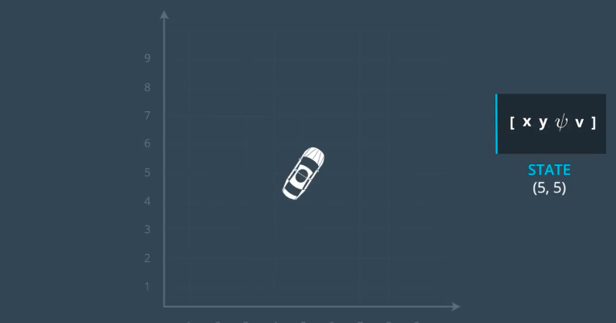

- 汽车的运动学模型

  > 为了使得我们实际的车的状态和汽车预测状态之间的误差最小，我们需要控制车辆驱动。
  >
  > 包括方向盘和加速/刹车输入。

  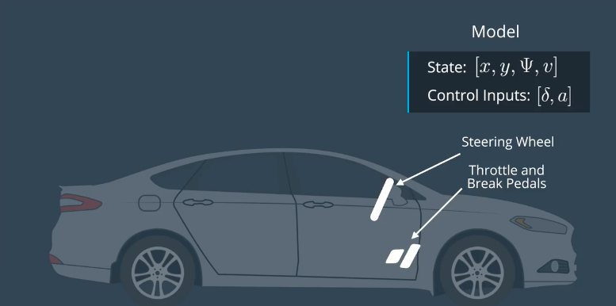

  > 根据上一时刻的汽车状态，预测下一时刻的状态，公式
  >
  > **注意：Lf表示汽车的头部到汽车重心的距离，距离越大，转向角越小，反之亦然。  比如，大货车的转向角度要比小轿车的转向角度小，在转动方向盘相同角度的情况下**

  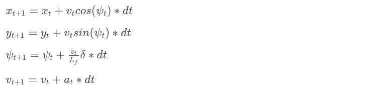

  > 实现全球运动学模型

  ```c++
  #include <math.h>
  #include <iostream>
  #include "Dense"

  double pi() { return M_PI; }
  double deg2rad(double x) { return x * pi() / 180; }
  double rad2deg(double x) { return x * 180 / pi(); }

  const double Lf = 2;

  Eigen::VectorXd globalKinematic(Eigen::VectorXd state,
                                  Eigen::VectorXd actuators, double dt) {
    Eigen::VectorXd next_state(state.size());
    
    // the next state from inputs
    // NOTE: state is [x, y, psi, v]
    // NOTE: actuators is [delta, a]
    next_state[0] = state[0] + state[3]*cos(state[2])*dt;
    next_state[1] = state[1] + state[3]*sin(state[2])*dt;
    next_state[2] = state[2] + state[3]/Lf*actuators[0]*dt;
    next_state[3] = state[3] + actuators[1]*dt;
    
    return next_state;
  }

  int main() {
    // [x, y, psi, v]
    Eigen::VectorXd state(4);
    Eigen::VectorXd actuators(2);
    state << 0, 0, deg2rad(45), 1;
    actuators << deg2rad(5), 1;
    Eigen::VectorXd next_state = globalKinematic(state, actuators, 0.3);
    std::cout << next_state << std::endl;
  }
  ```

- 无人驾驶的整体过程

  > 感知 => 定位 => 路径规划 => 车辆控制

  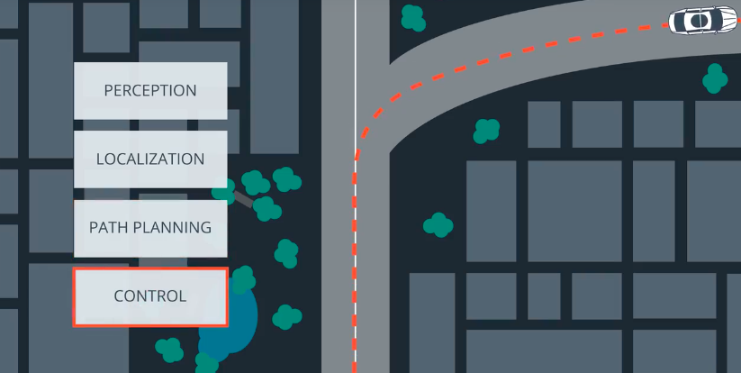

- 使用多项式拟合规划路径

  > 一般三次多项式就能满足要求

  ```c++
  // In this quiz you'll fit a polynomial to waypoints.

  #include <iostream>
  #include "Dense"

  using namespace Eigen;

  // Evaluate a polynomial.
  double polyeval(Eigen::VectorXd coeffs, double x) {
    double result = 0.0;
    for (int i = 0; i < coeffs.size(); i++) {
      result += coeffs[i] * pow(x, i);
    }
    return result;
  }

  // Fit a polynomial.
  // Adapted from
  // https://github.com/JuliaMath/Polynomials.jl/blob/master/src/Polynomials.jl#L676-L716
  Eigen::VectorXd polyfit(Eigen::VectorXd xvals, Eigen::VectorXd yvals, int order) {
    assert(xvals.size() == yvals.size());
    assert(order >= 1 && order <= xvals.size() - 1);
    Eigen::MatrixXd A(xvals.size(), order + 1);

    for (int i = 0; i < xvals.size(); i++) {
      A(i, 0) = 1.0;
    }

    for (int j = 0; j < xvals.size(); j++) {
      for (int i = 0; i < order; i++) {
        A(j, i + 1) = A(j, i) * xvals(j);
      }
    }

    auto Q = A.householderQr();
    auto result = Q.solve(yvals);
    return result;
  }

  int main() {
    Eigen::VectorXd xvals(6);
    Eigen::VectorXd yvals(6);
    // x waypoint coordinates
    xvals << 9.261977, -2.06803, -19.6663, -36.868, -51.6263, -66.3482;
    // y waypoint coordinates
    yvals << 5.17, -2.25, -15.306, -29.46, -42.85, -57.6116;

    // coordinates.
    Eigen::VectorXd fit_curve = polyfit(xvals,yvals,3);

    for (double x = 0; x <= 20; x += 1.0) {
      std::cout << polyeval(fit_curve,x) << std::endl; 
    }  
  }
  ```

- 计算误差

  > 把错误的变化包括到状态中 ，那么新的状态向量为 [x,y,ψ,v,cte,eψ]，向量一共六维。
  >
  > 注意到增加了cte和eψ，表示和到预测路径距离的错误和预测路径方向的错误。

- Cross Track Error（CTE）

  > 通过前一个状态的误差，估计后一状态的误差。
  >
  > yt表示当前所在的位置，f(xt)表示预测路径所在的位置

  ctet+1 = ctet  +  vt∗sin(eψt)∗dt

  ctet = yt − f(xt)

  合并：

  ctet+1 = yt − f(xt) + (vt∗sin(eψt)∗dt)

- Orientation Error，方向误差

  注意：我们并不知道ψdest的规划路径的角度值，可以使用求斜率，再求arctan的方式求得，arctan(f′(xt))。

  

  

  合并：

  


## 模型预测

模型预测把路径追踪任务变成了一个优化问题，即寻找最小成本的轨迹，这个地方的成本就是指在满足指定限制条件的基础上，使得路径和参考路径的距离值和角度值最贴近。

总体步骤：

1. 获取当前状态和参考路径
2. 根据当前状态和参考路径，预测轨迹，包括N个控制点，每个点控制的时间段dt，总时间T=N*dt。
3. 控制驱动器输入，第一个控制点的数据。
4. 第一个控制点完成之后，从第一步再递归进行。

> 为什么不进行一次性预测完成，执行每个控制点之后走完，再预测？
>
> 因为现实世界会有各种误差，导致实际情况并不是和预测轨迹一致，所以预测一次走一个控制点。所以MPC也叫“滚动时域控制”。

- 计算误差

  > 为了减小误差，我们需要调整驱动器输入，控制车辆实际的行驶路径和规划路径的距离误差尽可能的小。

  计算每一个时间点的错误累计：

  ```c++
  double cost = 0;
  for (int t = 0; t < N; t++) {
      cost += pow(cte[t], 2);
      cost += pow(epsi[t], 2);
  }
  ```

  但是如上的代码可能有两个问题：

  1. 车辆可能在其中的某个位置停止。
  2. 车辆的行驶线路可能是很不平滑的。

  解决车辆可能停止的办法：

  1. 把速度加入成本函数。
  2. 把当前位置距离终点的距离加入成本函数。

  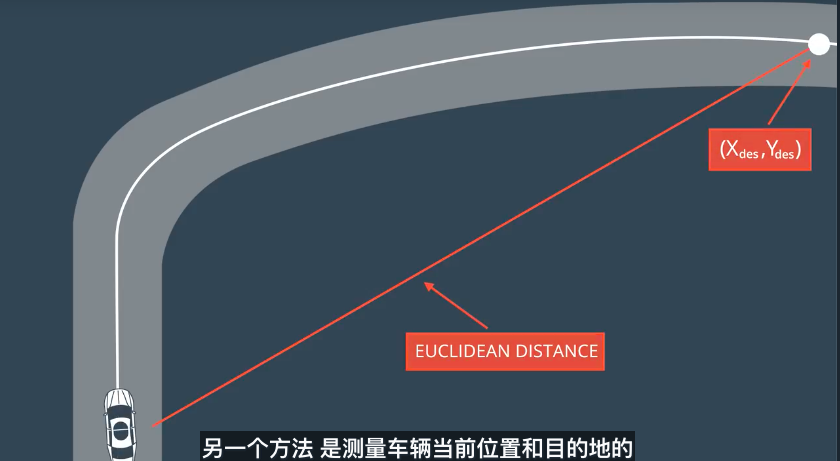

  解决行驶线路不平滑的问题：把车辆控制参数加入成本函数,两次控制的变化不能太大。

  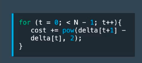

- 预测线路区间T，由两部分组成N和dt，其中，N表示预测线路有多少个预测点，dt表示每一个预测点的执行的时间。例如：假设一共有20个预测点N=20，每个预测点的时间dt=0.5，则T为20x0.5=10秒。

  注意：在下面的图中状态点有7个但是驱动控制向量只有6个，可以这样理解，驱动控制的结果是下一个状态点，最后一个状态点没有下一个状态点，所以不需要驱动输入。

  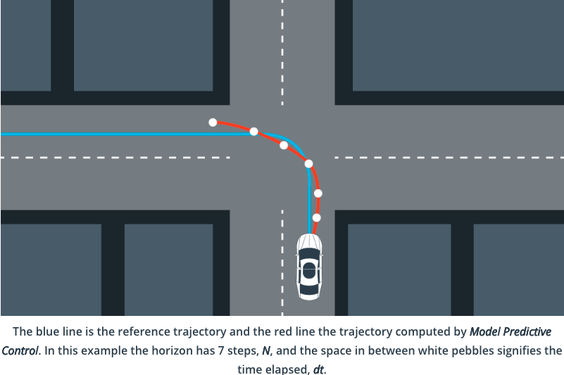

- 合并

  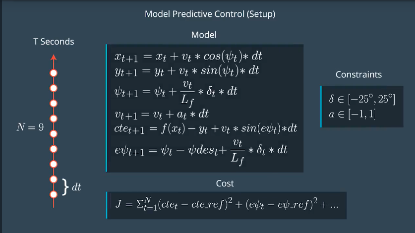

- PID和MPC的优缺点比较

  PID：有延迟影响，PID基于当前的状态计算出驱动指令，向驱动器发送命令到驱动器执行完成，这之间有一个延迟的过程，差不多100ms，所以等到执行命令的时候状态已经变化，会出现不稳定的情况。

  MPC：由于MPC有预测模型，通过当前状态能预测出下一状态，比如：可以使用当前状态走一个延迟，计算之后的状态作为初始状态进行控制。

  **总结：MPC控制比PID控制在处理延迟方面更加的高效。**

- 需要用到的一些库

  [Ipopt](https://projects.coin-or.org/Ipopt/)：可以通过使得最小化成本函数，获得最优驱动输入[δ1,a1,...,δN−1,aN−1]，由于需要加上驱动限制Ipopt 需要使用雅可比(jacobians)和黑塞(haishens)矩阵，他不会直接计算，所以使用到了CppAD。

  [CppAD](https://www.coin-or.org/CppAD/)：用于求自动微分，调用数学函数的时候需要使用CppAD::作为前缀，比如：```CppAD::pow(x, 2);```，使用CppAD的返回类型，比如：```CppAD<double>```代替```double```。


## 


## What we have learned so far

From the previous lessons we have learned to apply the bicycle model, polynomial fitting, low complexity heuristics (e.g. CTE), and short time steps, to enable vehicles to follow a complex (polynomial) trajectories. This is an effective, practical, and commonly used approach, which can be applied to many autonomous vehicle scenarios, in real time.

## Coming Next

For the next few lessons we will round out our discussion of vehicle models with an overview of the more comprehensive, but less practical, dynamic models. Dynamic models and the elements which comprise them are rigorous and could be modules or courses unto themselves. The content that follows is targeted developing awareness and intuition that can be applied to further study and consists of:

- Dynamic Model Forces
- Tire Slip Angle
- Tire Slip Ratio
- Tire Models

Additional resources are linked to each lesson to encourage and enable more in depth study. [One of these resources](http://www.me.berkeley.edu/~frborrel/pdfpub/IV_KinematicMPC_jason.pdf) makes a good case for the use of lower complexity kinematic models, as:

> Compared to higher fidelity vehicle models, the system identification on the kinematic bicycle model is easier because there are only two parameters to identify, lf and lr. This makes it simpler to port the same controller or path planner to other vehicles with differently sized wheelbases.

To further expand on this, lower complexity models have two strong advantages over higher complexity (dynamic included) models. They can run in real time (essential requirement of any model operating in a vehicle) and they are transferable to vehicles with differing attributes, such as mass. To use a dynamic model engineers would have to be able to control the vehicle attributes of the vehicles they are deploying models into (they probably won't have control over this). High complexity models would need major re-adjustment to account for even small differences. Lower complexity models do not suffer from this constraint and so can be placed in a wider range of vehicles, with far less additional effort, and unpredictability.

Another frequently asked question is where our model comes from and why it differs from other models seen in the program and from other sources.

The kinematic model we derive and use here is not quite the same as in the Berkeley paper (linked above), although they are similar. It is possible to use different models in different parts of your pipeline, depending on what levels of accuracy you need in different places. It is common to see this in industry. The principles of model we present can be applied to add parameters into the model to make models fit to purpose.

- 运动模型—力

  > 汽车所受力可以总结为横向力和纵向力度，横向力帮助转弯，纵向力帮助车辆前进/后退。

  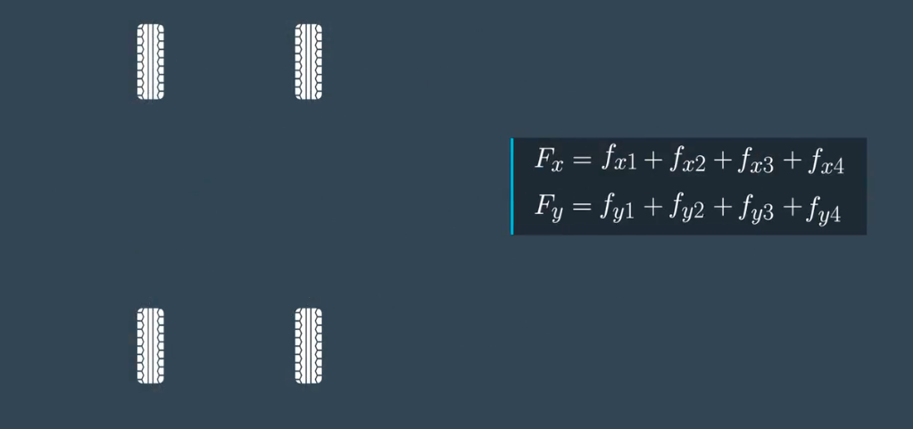

- 运动模型—偏离角（Slip angle）

  > 偏离角可以帮助车辆转弯

  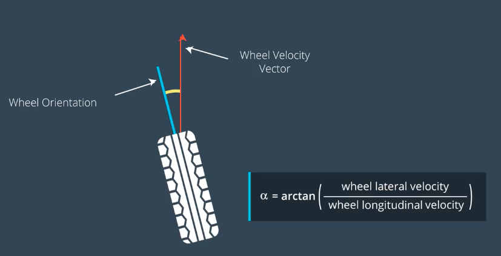

- 滑动比例(Slip ratio)，可以使用它来控制车辆的横向和纵向力。

  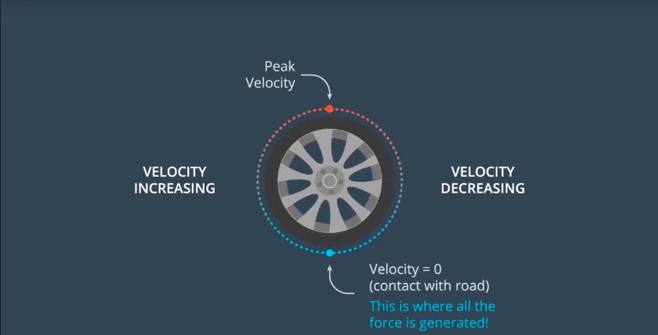

- 轮胎模型

  > a表示转角度，F表示横向力。

  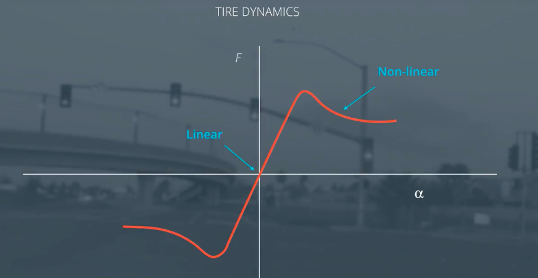

- 驱动器约束条件

  >比如车辆的转向角度不能大于90度，车辆的

- 模型预测

- ## Visualization

  When working on the MPC project it helps to visualize both your reference path and the MPC trajectory path.

  You can display these connected point paths in the simulator by sending a list of optional x and y values to the `mpc_x`,`mpc_y`, `next_x`, and `next_y` fields in the C++ main script. If these fields are left untouched then simply no path will be displayed.

  The `mpc_x` and `mpc_y` variables display a line projection in green. The `next_x` and `next_y` variables display a line projection in yellow. You can display these both at the same time, as seen in the image above.

  These (x,y) points are displayed in reference to the vehicle's coordinate system. Recall that the x axis always points in the direction of the car’s heading and the y axis points to the left of the car. So if you wanted to display a point 10 units directly in front of the car, you could set `next_x = {10.0}` and `next_y = {0.0}`.

  Remember that the server returns waypoints using the map's coordinate system, which is different than the car's coordinate system. Transforming these waypoints will make it easier to both display them and to calculate the CTE and Epsi values for the model predictive controller.

  ## IPOPT Installation on Mac

  When executing `brew install ipopt`, some Mac users have experienced the following error:

  ```
  Listening to port 4567
  Connected!!!
  mpc(4561,0x7ffff1eed3c0) malloc: *** error for object 0x7f911e007600: incorrect checksum for freed object - object was probably modified after being freed.
  *** set a breakpoint in malloc_error_break to debug

  ```

- This error has been resolved by upgrading ipopt with `brew upgrade ipopt --with-openblas` per this [forum post](https://discussions.udacity.com/t/incorrect-checksum-for-freed-object/313433/19).

- ​

  ​