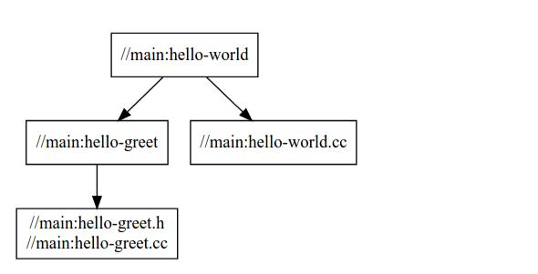

## Bazel工具介绍

- 简介

  > Bazel是一个类似于Make的编译工具，是Google为其内部软件开发的特点量身定制的工具，如今Google使用它来构建内部大多数的软件。Google认为直接用Makefile构建软件速度太慢，结果不可靠，所以构建了一个新的工具叫做Bazel，Bazel的规则层级更高。可以用来构建C++、Java和shell等代码。

- 安装Bazel

  [请参考](https://docs.bazel.build/versions/master/install.html)

- 建立工作区（workspace）

  >  工作区是项目的根目录，其下面包含了源代码和Bazel的编译输出，其下面有两个**文件**Bazel能识别。

  1. WORKSPACE文件：标志该目录为workspace目录，即为项目的根目录。
  2. BUILD文件：如果一个目录下包含BUILD则表明它是一个package，该文件用于告诉Bazel如何构建项目。

  一个项目下可以有多个package，每个package可以有多个源文件。

  > 如下的目录结构，project表示项目根目录，main和lib表示项目下的两个包

  ```
  project
      └── main
         ├── BUILD
         ├── hello-world.cc
         ├── hello-world.h
      └── lib
         ├── BUILD
         ├── hello-greet.cc
         ├── hello-greet.h
      └── WORKSPACE
  ```

- BUILD文件

  BUILD文件中包含一些指令，最重要的是编译指令，每一条指令可以指定源代码和依赖，每一条指令代表一个target。

  > 下面的代码使用了Bazel内置的cc_binary指令，来构建了两个可以执行的二进制文件。
  >
  > cc_library：指令的名称
  >
  > name：生成的target的名称
  >
  > srcs：源码文件名
  >
  > hdrs：源码头文件名
  >
  > deps：依赖的库
  >
  > visibility：设置库对项目下的哪些包可见。

  ```
  cc_library(
      name = "hello-greet",
      srcs = ["hello-greet.cc"],
      hdrs = ["hello-greet.h"],
      visibility = ["//main:__pkg__"],
  )

  cc_binary(
      name = "hello-world",
      srcs = ["hello-world.cc"],
      deps = [
          ":hello-greet",
      ],
  )
  ```

- 基于如上的BUILD文件，编译Bazel项目

  > 执行命令：bazel   build    //main:hello-world
  >
  > “//” 表示项目的根目录，所以“//main:hello-world”表示项目的根目录下的main包BUILD文件中的hello-world  目标任务。

  > 编译完成界面输出如下，表示编译成功：

  ```
  INFO: Found 1 target...
  Target //main:hello-world up-to-date:
    bazel-bin/main/hello-world
  INFO: Elapsed time: 2.267s, Critical Path: 0.25s
  ```

  > 执行完成后的二进制文件放在根目录下的bazel-bin目录中。直接执行该文件：bazel-bin/main/hello-world。

- 生成依赖图命令

  > 这个指令告诉Bazel查找target `//main:hello-world`的所有依赖项（不包括host和隐式依赖），然后输出图的文字描述。再把文字描述贴到[GraphViz](http://www.webgraphviz.com/)里，你就可以看到如下的依赖图了。可以看出这个项目是用单个源文件编译出的单个target，并没有别的依赖。

  ```
  bazel query --nohost_deps --noimplicit_deps 'deps(//main:hello-world)' \ --output graph
  ```

- 查看依赖图

  

  ​

  ​

  ​