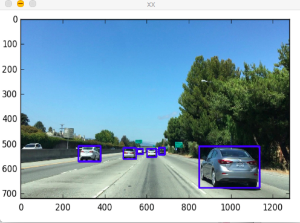

## mac下在eclipse中安装c++编译环境

1. 下载CDT

   在[这个](http://www.eclipse.org/cdt/downloads.php)页面找到和eclipse对应的CDT版本（安装9.3及其以上的版本，之前的有bug），复制路径到eclipse。

   执行安装，一路下一步就可以了。

   

2. 导入头文件的时候，提示找不到 iostream，解决方法：

   Go to Project > Properties > C/C++ General > Preprocessor Includes... > Providers 
   and select "**CDT GCC Built-in Compiler Settings**". 

   

3. 执行的时候提示，Launch Failed. Binary not found。解决方法：

   project-> Properties-> C/C++ Build-> Settings->Binary Parsers，在复选框里反复选择和取消Mach-O 64 Parser，并点ok。

4. 安装cmake

   - [下载](http://www.cmake.org/download/)安装程序

   | Unix/Linux Source (has \n line feeds) | [cmake-3.0.2.tar.gz](http://www.cmake.org/files/v3.0/cmake-3.0.2.tar.gz) |
   | ------------------------------------- | ------------------------------------------------------------ |
   |                                       |                                                              |

   - 安装

     进入到下载目录，解压缩 tar-zxvf filename

     进入到解压之后目录下，可以参考README的说明，执行

     sudo ./bootstrap 

     sudo make 

     sudo make install

   也可以使用homebrew安装

5. 安装opencv，[下载地址](https://opencv.org/opencv-3-4-1.html]())

   下载releases版本下的sources，因为没有mac版本的，需要自己进行编译。

   

   下载之后的文件内容：

   

   - 删除下面的两个文件和目录：

     1）先删除刚才在当前目录下创建的CMakeCache.txt文件和CMakeFIles目录；

     2）新建build目录，mkdir build。

   - 执行如下命令：

   ​        cd build

   ​        cmake -G "Unix Makefiles" ..

   ​	make

   ​        sudo make install

   ​       安装好之后的lib文件会自动存放在到“/usr/local/lib”文件夹，h文件存放到“/usr/local/include”

   - 创建项目，使用的是MacOSX GCC，其他的好像有点问题。

     

   - 在eclipse中添加路径引用

     - 点击项目的properties

       

     - ​

     

            

- 写一段代码测试

  ```c++
  /*
   * test.cpp
   *
   *  Created on: 2018年4月5日
   *      Author: xiaoqiangxie
   */

  #include <opencv2/core/mat.hpp>
  #include <opencv2/core/mat.inl.hpp>
  #include <opencv2/core/types.hpp>
  #include <opencv2/highgui.hpp>
  #include <opencv2/imgcodecs.hpp>
  #include <opencv2/imgproc.hpp>

  using namespace std;
  using namespace cv;

  int main(int argc, char **argv) {
  	Mat mat;
  	mat = imread("./car.jpg");
  	resize(mat, mat, Size(500, 350));
  	namedWindow("car");
  	imshow("xx", mat);
  	waitKey(0);
  	return 0;
  }
  ```

  