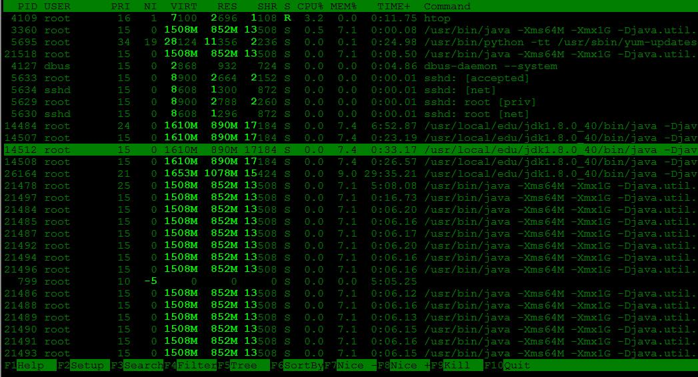

### Linux常用命令总结

- 登陆\退出

  ```
  # ssh连接成功，输入密码,-p 指定端口
  ssh root@192.168.10.222

  # 在ssh连接成功之后，如果命令执行时间过长，又想断开ssh，使用nohup(no hang up)，该命令会继续执行
  nohup wget http:#mirror.is.co.za/mirrors/linuxmint.com/iso#stable

  # 退出
  exit 或  ctrl + d
  ```


- 文件上传\下载

  ```
  #下载文件到当前目录（自定义名称）
  curl  -o name downloadurl 

  #下载文件到当前目录(使用默认名称)
  curl  -O  downloaduarl 

  #wget从指定的url下载文件，支持断点续传，参考http:#man.linuxde.net/wget
  wget downloaduarl

  # 如果遇到insecurely
  wget --no-check-certificate downloaduarl
  -c:支持断点续传
  -b:后台进行
  -i:下载多个文件
  -r:递归下载

  #scp，服务器之间传递数据，上传下载位置互换，若指定端口，添加参数-p,i.e: -p 8888
  scp /Users/Biao/Desktop/a.zip root@192.168.82.130:/root
  scp root@192.168.82.130:/root/a.zip /Users/Biao/Desktop
  ```

- 常用简单命令集合

  ```
  # 输出当前时间
  date

  # 当前计算机的名称
  hostname

  # 计算器，输出4(注意空格)
  expr 2 + 2

  # 获取udacity.com的ip
  host udacity.com  

  # 输出you rock(只是打印信息)
  echo you rock  

  # 输出操作系统的名称（linux系统为Linux）
  uname

  # 输出之前的命令
  history

  # bash版本
  bash --version

  # 现在时间、系统已运行时间、目前有多少登陆用户、系统在过去的1分钟、5分钟和15分钟内的平均负载。
  uptime

  # 查找之前使用的命令行
  ctrl + r

  # 可提供多个文件合并在一起显示（concrate的缩写）
  cat 1.xml 2.xml

  # 文件统计程序（一次返回文件行数，字数，字节数）
  wc filename

  # 分析两个文件的不同之处(-u表示标准化输出)
  diff -u 1.xml 2.xml

  # 检测指定的ip是否在运行
  ping ip

  # 用于排序
  sort 文件名称

  # 打印当前工作目录
  pwd

  # ~表示当前用户的根目录
  cd ~

  # 不加参数表示返回自己的根目录
  cd

  # 上一次的目录
  cd -

  # 文件/文件夹复制
  cp -r filename filepath

  # 文件 文件夹 移动
  mv -r filename filepath

  # 文件重命名
  mv -r filename filename2

  # 递归删除
  rm -rf file/filenamedirname

  # 创建目录，创建多个-p
  mkdir -p dirname/dirname1

  # 删除目录，如果文件夹下有东西需要递归删除，-p
  rmdir -p dirname/*

  # 查看安装的系统的位数
  getconf LONG_BIT

  # 显示某个目录结构下的文件以树结构显示。指定显示层级数，如果不指定显示所有层级。导出到指定文件。
  tree -L N /usr > /usr/mytree.txt
  ```

- less工具

  ```
  ‘>’  文件的最后一行

  ‘d或空格’向下滚动一页

  ‘u’ 向上滚动一页

  输入行数+enter跳转到指定的行

  ‘/指定字符’ + ENTER搜索指定的字符（实际是使用正则表达式匹配）

  ‘n’跳转到下一个查询出的字符  

  ‘N’ 跳转到上一个查询出的字符
  ```


- nano文本编辑器

  ```
  # 删除一个字符
  Ctrl + d

  # 剪贴一整行或选中区域
  Ctrl + K

  # 复制一整行或选中区域
  Alt + 6

  # 粘贴
  Ctrl + u

  # 搜索，输入查找的文本回车，一次只能查找一个
  Ctrl + w

  # 上一页
  Ctrl + y

  # 下一页
  Ctrl + v

  # 保存更改
  Ctrl + O

  # 退出
  Ctrl + x

  # 取消返回
  Ctrl + c
  ```

- 使用htop查看和管理进程，良好的进程展示和控制

  ```
  # 安装 htop
  sudo yum install htop

  # 查看进程
  htop
  ```

   可以使用F1—F10控制进程

  

- at，在特定的时间执行任务，只执行一次

  ```
  # 指定执行任务和时间
  at 10:38 PM Fri
  at> cowsay 'hello'
  at> CTRL + D

  # 列出所有的at任务
  atq

  # 删除某个at任务， id来自atq
  atrm id
  ```

- glob通配的使用：*（可加在字符串的前、中、后）  

  ```
  {} 例如：ls app.{css,html}  or ls app.css app.html 可以匹配括号里边的任何一个
  ？：匹配一个字符
  []:可以匹配方括号里边的任何一个字符
  ```


- 常用快捷键  

  ```
  # 将终端显示向上滚动
  Shift + PgUp

  # 将终端显示向下滚动
  Shift + PgDn

  # 暂停当前程序，暂停后按下任意键恢复运行
  Ctrl + s

  # 将当前程序放到后台运行
  Ctrl + z

  # 查看所有在后台运行的任务
  jobs

  # 恢复任务到前台显示， jobID来自jobs执行结果
  fg %  jobID

  # 任务到后台执行，jobID来自jobs执行结果
  bg % jobID 

  # 将光标移至输入行头，相当于Home键
  Ctrl + a

  # 将光标移至输入行末，相当于End键
  Ctrl + e

  # 剪切从光标所在位置到行末
  Ctrl + k

  # 剪切从光标位置到输入行头
  Ctrl + u

  # 粘贴复制的内容
  Ctrl + y

  # 剪切光标前一个单词
  Ctrl + w

  # 向终端内粘贴文本，，相当于windows的Ctrl + v
  Shift + Insert

  # 在终端复制文本，相当于windows的Ctrl + c
  Ctrl + Insert
  ```

- Shell 常用通配符

  字符	含义

  *：匹配 0 或多个字符
  ?：匹配任意一个字符
  [list]：匹配 list 中的任意单一字符
  [!list]：匹配 除list 中的任意单一字符以外的字符
  [c1-c2] ：匹配 c1-c2 中的任意单一字符 如：[0-9][a-z]
  {string1,string2,...} ：匹配 string1 或 string2 (或更多)其一字符串
  {c1..c2} ：[c1-c10]功能类似

- 查看man手册

  ```
  # 搜索
  /<你要搜索的关键字>

  # 下一个关键字
  n

  # 上一个关键字
  shift + n

  # 翻页，空格键
  space

  # 向下滚动一行
  Enter

  # 退出
  q

  # 获取比man更多的信息 
  info ls

  # --help，查看命令的每个参数意思
  ls --help
  ```

- who 命令其它常用参数

  参数	说明
  -a	打印能打印的全部
  -d	打印死掉的进程
  -m	同am i,mom likes
  -q	打印当前登录用户数及用户名
  -u	打印当前登录用户登录信息
  -r	打印运行等级

  who am i
  结果如下：
  root     pts/2        2017-12-18 09:50 (192.168.10.231)

- 用户权限和分组

  ```
  # 添加用户
  sudo adduser lilei 

  # 显示用户所在的分组
  groups lilei 

  # 把lilei添加到sudo分组
  sudo adduser lilei lilei 
  ```

- touch

  >  主要作用是来更改已有文件的时间戳的（比如，最近访问时间，最近修改时间），但其在不加任何参数的情况下，只指定一个文件名，则可以创建一个指定文件名的空白文件（不会覆盖已有同名文件），当然你也可以同时指定该文件的时间戳。

- 查看文件内容

  ```
  # 正序显示文件内容 （参数-n可以显示行号） 
  cat filename

  # 倒序显示文件内容，nl:显示行号，并打印（cat -n）
  tac filename

  # 上边只是显示文件的内容，但是一屏可能显示不完，可以使用more
  # 只能向下查看更多，空格--下一屏，enter-下一行 q:退出
  more filename

  # （可向上和向下）
  less filename

  # 显示文件的头几行或最后几行,-n 1：表示列出几行, -f:表示当文件改变的时候，可以滚动显示文件的内容
  head/tail filename

  # 查看文件类型
  file /
  ```

- 文件编辑

  ```
  h:左   j下：  k：上   l：右

  i:插入文本，在光标所在位置之前插入

  a:添加内容，在光标所在位置之后插入

  v 可以选择块状区域'

  o: 在光标所在行下面新增一行（并进入输入模式） 

  O: 在光标所在行上方新增一行（并进入输入模式） 

  x: 删除光标所在字符，等同于[Delete]功能键 

  X: 删除光标前字符，相当与[Backspace] 

  r: 修改光标所在字符 

  R: 替换当前字符及其后的字符，直到按 [ESC] 
  ```

- 删除

  ```
  dw:删除从光标开始后一个单词

  d$:删除从光标开始的位置到行末

  do:删除至行尾

  x:删除光标所在地方的字母

  ```

- 复制

  ```
  复制一行则：yy

  复制多行(n代表具体数字)：nyy

  复制到行首：y$

  复制到行末：y^

  ```

- 粘贴

  ```
  p
  ```

- 剪切

  ```
  剪切一行：dd 

  前切n行：ndd

  剪切到行尾：d$

  剪切到行首：d^

  剪切选中文本：d

  撤销与恢复： 

  'u' : 撤销上一个编辑操作

  'ctrl + r' : 恢复，即回退前一个命令 

  'U' : 行撤销，撤销所有在前一个编辑行上的操作

  ```

- 翻屏

  ```
  Ctrl+u: 向上翻半屏 

  Ctrl+f: 向上翻一屏

  Ctrl+d: 向下翻半屏 

  Ctrl＋b: 向下翻一屏
  ```

- 移动光标

  ```
  space: 光标右移一个字符 

  Backspace: 光标左移一个字符 

  Enter: 光标下移一行

  nG: 光标移至第n行首

  n+: 光标下移n行 

  n-: 光标上移n行
  ```

- 查找

  ```
  /str 查找字符串所在的位置

  n:下一个匹配字符

  N：上一个匹配字符
  ```

- 环境变量和文件查找

  declare:声明变量 （declare tmp=1）
  echo $tmp ($表示引用变量)

  命 令	说 明
  set	显示当前 Shell 所有变量，包括其内建环境变量（与 Shell 外观等相关），用户自定义变量及导出的环境变量。
  env	显示与当前用户相关的环境变量，还可以让命令在指定环境中运行。
  export	显示从 Shell 中导出成环境变量的变量，也能通过它将自定义变量导出为环境变量。

  环境变量
  永久的：需要修改配置文件，变量永久生效；
  临时的：使用 export 命令行声明即可，变量在关闭 shell 时失效。

  这里介绍两个重要文件 /etc/bashrc（有的 Linux 没有这个文件） 和 /etc/profile ，它们分别存放的是 shell 变量和环境变量。
  还有要注意区别的是每个用户目录下的一个隐藏文件,.profile(只对当前用户永久有效)

  添加环境变量：

  ```
  $PATH = PATH:/home/shiyanlou/mybin
  ```

  只对当前shell有效，一旦退出再打开就失效了
  unset s #删除一个变量名称

  在每个用户的 home 目录中有一个 Shell 每次启动时会默认执行一个配置脚本，以初始化环境，包括添加一些用户自定义环境变量等等。
  zsh 的配置文件是 .zshrc，相应 Bash 的配置文件为 .bashrc 。它们在 etc 下还都有一个或多个全局的配置文件，不过我们一般只修改用户目录下的配置文件。

- 搜索文件

  与搜索相关的命令常用的有 whereis，which，find 和 locate 。

  whereis:只能搜索二进制文件 和 man帮助文件和源代码文件

      -b:只查二进制文件
      -m:只查man文件
      -s:

  locate:查找数据库中的文件，不会实时更新，需要用updatedb刷新，

      -c:指定查找文件的数目
      -i:忽略大小写
      例如：locate /etc/sh 匹配以sh开头的文件（会递归查找子目录的文件）

  which：查找是否安装了某个命令

  find 应该是这几个命令中最强大的了，它不但可以通过文件类型、文件名进行查找而且可以根据文件的属性（如文件的时间戳，文件的权限等）进行搜索。find 命令强大到，要把它讲明白至少需要单独好几节课程才行，我们这里只介绍一些常用的内容。
  注意 find 命令的路径是作为第一个参数的， 基本命令格式为 find [path] [option] [action] 。

  与时间相关的命令参数：
  参数	说明
  -atime	最后访问时间
  -ctime	最后修改文件内容的时间
  -mtime	最后修改文件属性的时间


- 查看文件

  ```
  # 查看文件（S:按大小排序）
  ls -AsSh 

  # 查看单个文件的大小等信息
  du -h /
  ```

- 修改文件的所有者和权限

  ```
  # 修改指定文件的所有者
  chown shiyanlou iphone6
  # 修改文件的权限r=4,w=2,x=1
  chmod 700 iphone6
  # 修改文件的权限，g、o 还有u分别表示group、others和user，+ 和 - 分别表示增加和去掉相应的权限
  chmod go-rw iphone6
  ```

- 压缩文件打包与解压

  zip：
  打包 ：zip something.zip something （目录请加 -r 参数, -x “something /*”,不压缩指定目录下的文件）
  解包：unzip something.zip
  指定路径：-d 参数
  tar：
  打包：tar -zcvf something.tar something
  解包：tar -zxvf something.tar
  指定路径：-C 参数(只能使用绝对路径)

  7z(可以实现跨平台，数据压缩不会出现问题):

  安装p7zip：yum install p7zip或 [下载](https://sourceforge.net/projects/p7zip/files/p7zip/)

  > 注意：下载的文件是tar.bz2结尾的，使用这个命令解压，tar -xjf  p7zip_16.02_x86_linux_bin.tar.bz2
  >
  > 且该文件是针对32位系统的，执行这个命令就可以了：yum install glibc.i686

  解压： 7z  x  filename.7z

  压缩：7z   a  filename.7z filename

- 文件系统操作与文件管理

  ```
  df -h 显示所有的挂载点
  du -h 显示单个文件的大小
  参数说明： -h # 同--human-readable 以K，M，G为单位，提高信息的可读性。
  		 -a # 同--all 显示目录中所有文件的大小。
  		 -s # 同--summarize 仅显示总计，只列出最后加总的值。
  ```

- Linux任务计划crontab

  通常，crontab储存的指令被守护进程激活，crond 为其守护进程，crond常常在后台运行，每一分钟会检查一次是否有预定的作业需要执行。

  定义任务执行时间格式

  ```
  Example of job definition:
  .---------------- minute (0 - 59)
  |  .------------- hour (0 - 23)
  |  |  .---------- day of month (1 - 31)
  |  |  |  .------- month (1 - 12) OR jan,feb,mar,apr ...
  |  |  |  |  .---- day of week (0 - 6) (Sunday=0 or 7) OR sun,mon,tue,wed,thu,fri,sat
  |  |  |  |  |
  *  *  *  *  * user-name command to be executed
  ```

  crontab的准备工作
  1.sudo service rsyslog start
  2.sudo cron －f &
  前两步默认会自动启动
  3.crontab -e


- 进程

  ```
  # 列出所有进程长格式的详细信息
  ps -ef 

  # 列出当前用户所有跟terminal关联的进程详细信息
  ps -af 

  # 列出所有进程的信息
  ps -ax 
  ```

- netstat、telnet查看端口状态

  ```
  # 判断端口是否能访问
  telnet 192.168.10.222 8888

  # 查看所有udp端口
  netstate -nulp

  # 查看所有tcp端口
  netstate -ntlp

  # 查看指定端口的应用程序
  lsof -i :8888
  参数说明：
  　  -t : 指明显示TCP端口
  　　-u : 指明显示UDP端口
  　　-l : 仅显示监听套接字(所谓套接字就是使应用程序能够读写与收发通讯协议(protocol)与资料的程序)
  　　-p : 显示进程标识符和程序名称，每一个套接字/端口都属于一个程序
  　　-n : 不进行DNS轮询，显示IP(可以加速操作)
  ```

- chkconfig查看和停止linux启动的服务

  ```
  #注意：添加服务到chkconfig之前，需要把启动文件nexus放到/etc/init.d目录
  #修改配置/etc/init.d/nexus， 指定nexus文件的home目录
  NEXUS_HOME="/data/edu/nexus/nexus-2.14.8-01"

  # 执行命令，成功加入chkconfig服务列表
  chkconfig --add nexus
  chkconfig --level 35 nexus on

  #列出所有的系统服务。
  chkconfig --list

  #增加nexus服务。
  chkconfig --add nexus

  #删除nexus服务。
  chkconfig --del nexus

  #设置nexus在运行级别为2、3、4、5的情况下都是on（开启）的状态。
  chkconfig --level nexus 2345 on        

  #列出nexus服务设置情况。
  chkconfig --list nexusx 

  #设定mysqld在各等级为on，“各等级”包括2、3、4、5等级。
  chkconfig nexus on

  # 加上之后就可以使用下面的命令进行服务管理了
  service nexus restart
  service nexus start
  service nexus stop
  ```

- mysql

  ```sql
  # 导出数据为csv
  ./mysql -hlocalhost -uroot -ptiger_sun -e "select * from t_tag_result_detail" cws_db > file.csv
  ```

- 在linux中添加字体

  > 用于解决了报表不能显示中文的问题
  >
  > 参考[文章](https://blog.csdn.net/redlevin/article/details/79631856)

  ```
  # 安装fontconfig，使用fontconfig安装字体库
  yum -y install fontconfig

  # 进入share目录可以看到多了fonts和fontconfig目录
  cd /usr/share

  # 在/usr/shared/fonts目录下新建一个目录chinese
  mdkir chinese

  # 在C:\Windows\Fonts目录下找到字体，且把字体放入刚才创建的chinese目录下
  # 设置访问权限
  chmod -R 755 /usr/share/fonts/chinese

  # 接下来需要安装ttmkfdir来搜索目录中所有的字体信息，并汇总生成fonts.scale文件
  yum -y install ttmkfdir

  # 执行ttmkfdir命令
  ttmkfdir -e /usr/share/X11/fonts/encodings/encodings.dir

  # 编辑/etc/fonts/fonts.conf
  vi /etc/fonts/fonts.conf

  # 把新加的字体加到Font list中
  <dir>/usr/share/fonts/chinese</dir>

  # 刷新字体缓存
  fc-cache

  # fc-list查看字体列表
  fc-list
  ```

  ​