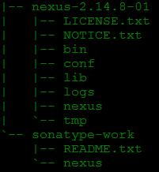
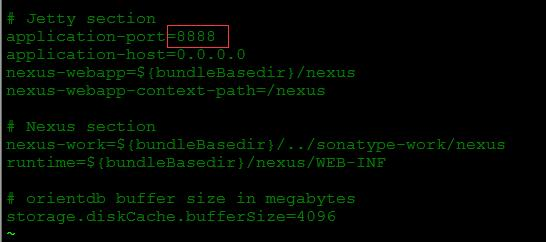
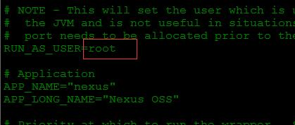
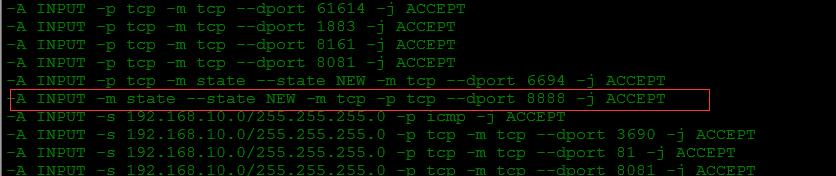
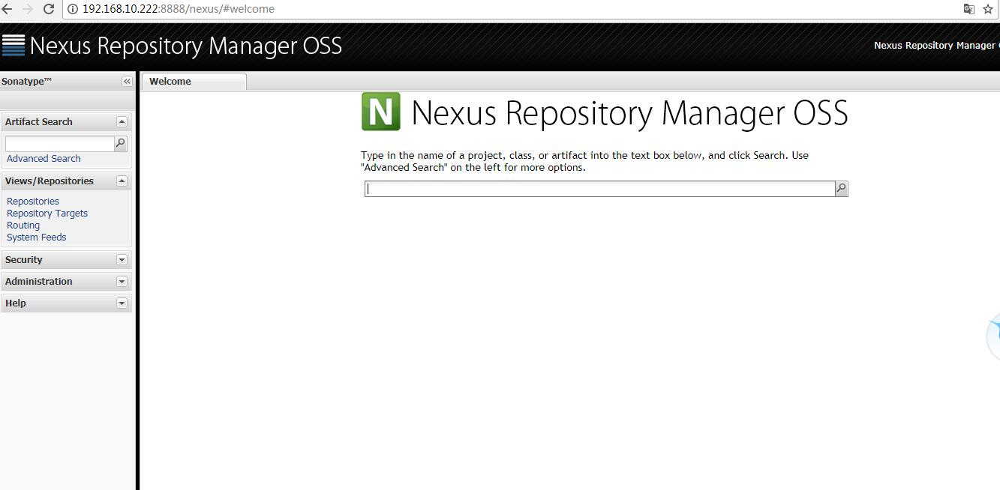

1. 进入目录

   cd /data/edu

2. 下载文件

   wget  [https://sonatype-download.global.ssl.fastly.net/nexus/oss/nexus-2.14.8-01-bundle.tar.gz]( https://sonatype-download.global.ssl.fastly.net/nexus/oss/nexus-2.14.8-01-bundle.tar.gz)

3. 创建目录

   mkdir nexus

4. 解压

   tar -xzvf nexus-2.14.8-01-bundle.tar.gz -C nexus

5. 文件目录

   

6. 修改配置文件

   cd nexus-2.14.8-01/conf

   vim nexus.properties  // 修改成端口，默认为8081

   

7. 修改nexus文件

   cd ../../bin

   vim nexus

   

8. 去掉防火墙限制

   vim /etc/sysconfig/iptables

   // 添加行

   -A INPUT -m state --state NEW -m tcp -p tcp --dport 8888 -j ACCEPT

   

9. 启动nexus

   ./nexus start

10. 通过浏览器访问，默认的账号密码是 admin  admin123

    

    ​

