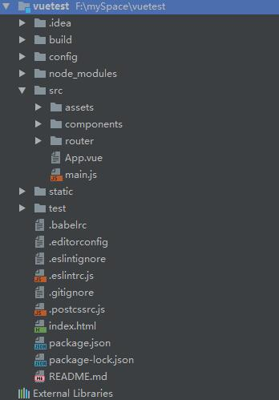

 Vue两大核心思想，组件化和数据驱动。

​	

1. 使用npm全局安装vue-cli

   github地址：[](https://github.com/vuejs/vue-cli)

   ```
   npm install --global vue-cli
   ```

2. 进入工作空间创建项目

   ```
   # 第一个参数表示使用模板的名称，第二个表示创建的项目名称
   vue init webpack vuetest
   # 如果要查看官方有哪些指定的模板文件
   vue list
   ```

3. 项目目录

   

   - build  ：里面是一些操作文件，使用npm run *    时其实执行的就是这里的文件

   - config： 配置文件，执行文件需要的配置信息

   - node_modules : node下载的文件

   - src  ： 资源文件，所有的组件以及所用的图片都放在下面

     - assets：资源文件夹，放图片之类的资源


     - components：  组件文件夹，写的所有组件都放在这个文件夹下
     - router：  路由文件夹
     - App.vue : 所有自己写的组件，都是在这个组件之上运行了
     - main.js  :  webpack入口文件

   - static ： 静态资源文件

4. 安装所有得模块

   ```
   npm install
   ```

5. 运行项目

   ```
   npm run dev
   ```

6. 安装生产环境需要的包

   ```
   cnpm install --production
   ```

   ​

7. 项目打包

   ```
   npm run build
   ```

8. 打包完成之后还不能立即访问，需要设置config\index.js文件下的build对象，将assetsPublicPath得/改为./

9. 这样就可以访问了http://localhost:8080

   

   ​

   ​